# BERT & GPT

## BERT

Bert 本质就是一个 Transformer Encoder。输入一个 Vector Set，输出一个 Vector Set。他的训练方式是 Self-supervised Learning，也就是不需要 label 的。他的训练被分为了两个任务，这种对自监督模型先进行得训练又被成为预训练。预训练后的模可以通过 fine-tune（微调）用于其他下游任务中。

### Pre-training Task

#### Masking Input

对输入序列的一个 Token（汉字，或者某种其他的最小单位）进行 Masking 操作，然后只关注这个 Token 对应的 Embedding 结果，力求 BERT 可以把这个 “空” 还原。即做填空题。

Masking 的方法也很多：
- 可以用一个特殊的 [Mask] 向量代替要被 mask 的向量。
- 也可以随机用别的 Token 代替要被 mask 的向量。

#### Next Sentence Prediction

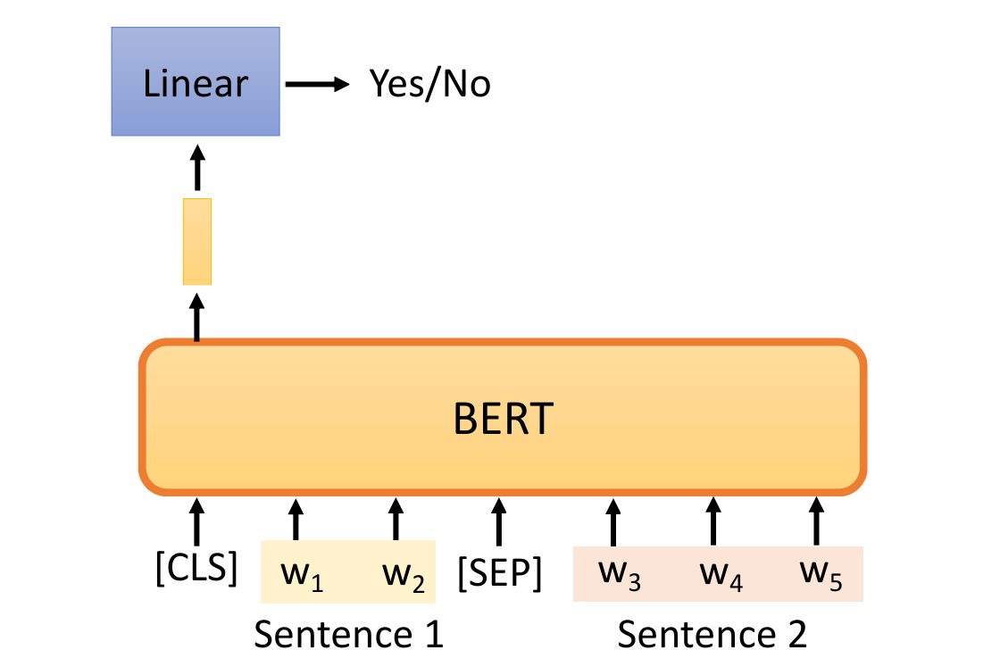

输入两个句子 s1 和 s2。注意输入格式，有两个特殊 Token，一个是 [CLS] 一个是 [SEP]。[CLS] 在后续很多下游任务中可作为一个用来分类的 Token。[SEP] 则表示分割。

Next Sentence Prediction 的任务就是输入两个句子 s1 和 s2。利用 [CLS] 做一个二分类，判这两句话是否是上下句关系。

但是不幸的是，这个任务后来被很多论文反驳道作用不大。并且出现了很多代替 Next Sentence Prediction 的任务，比如   Sentence order prediction 等。

### How to Use Bert

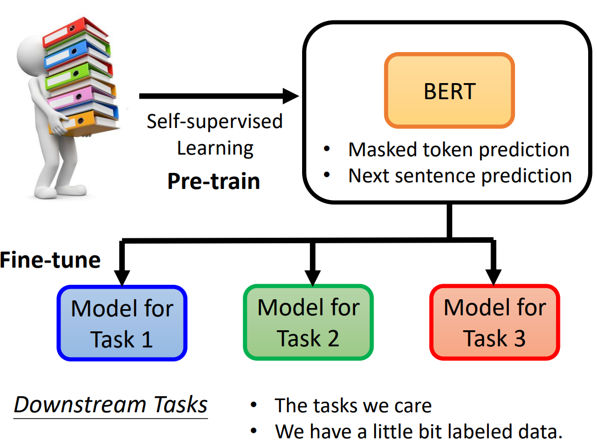

前面提到过，Bert 作为一个自监督的模型，其存在的意义即是为下游任务提供一个预训练的模型。

#### Case 1: Seq to Scale

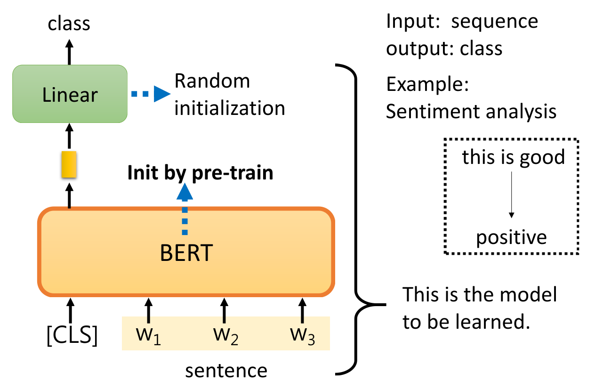

#### Case 2: Label Each Vector

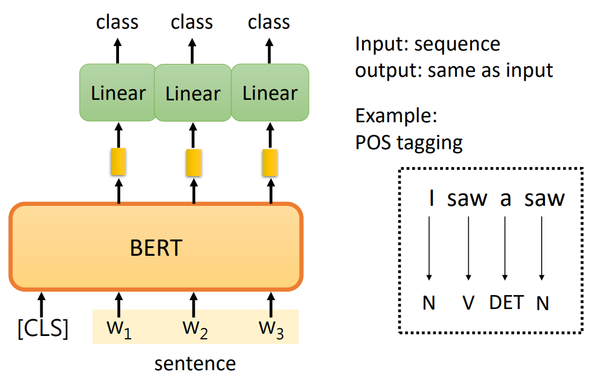

#### Case 3: Natural Language Inference (NLI)

类似于训练过程的 Next Sentence Prediction，实际是一个分类任务。

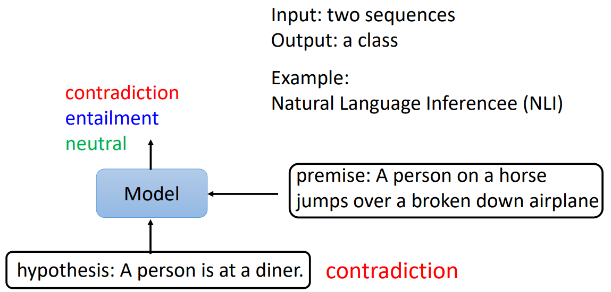

#### Case 4: Extraction-based Question Answering (QA)

一个 QA 模型，输入问题（query）和文档（Document），输出 **两个整数**，两个整数作为索引在 Document 中定位出的一段 Token，就是 Answer。

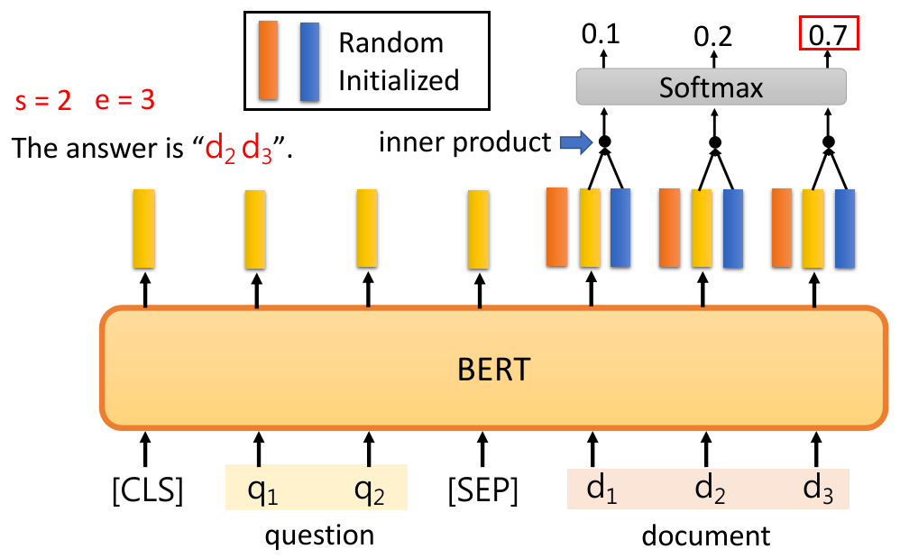

### Why does Bert Work?

Embedding 后的 vector 是结合 **上下文** 的，反映这个 Token 意思的 vector。比如：

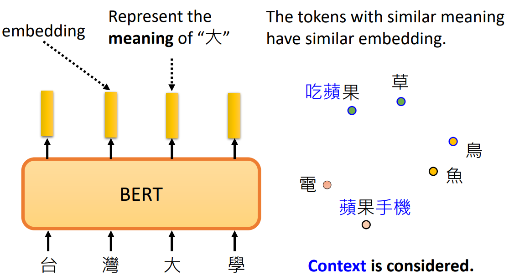

我们可以着眼于汉字 “果”，算不同语境下 “果” 字的 Embedding Vector 的相似度（余弦 ）：

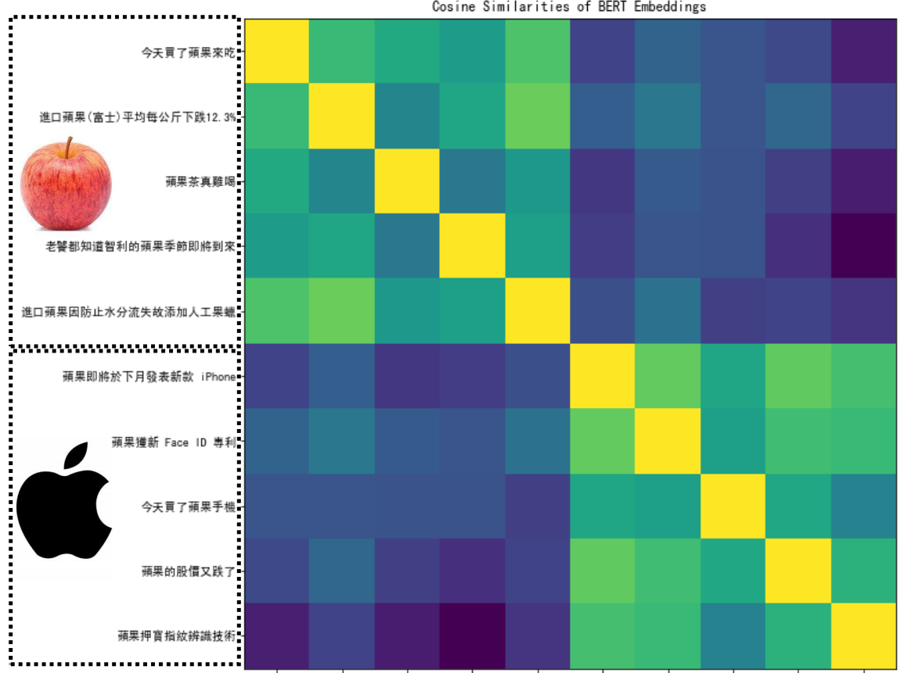

#### Multi-lingual BERT

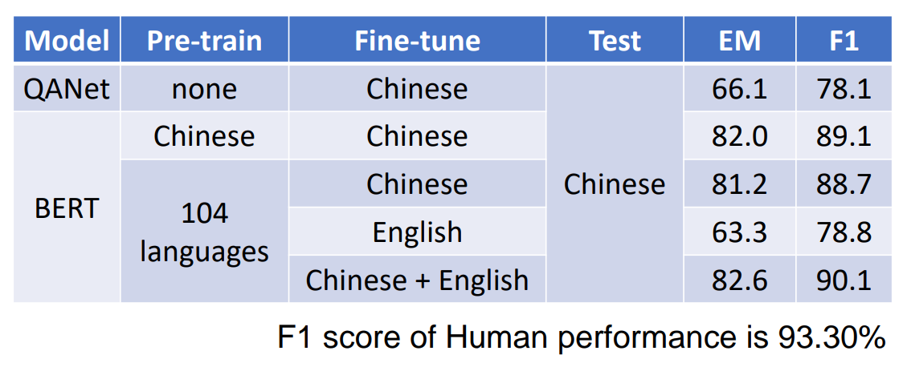

1. 需要大量，巨量的数据
2. Bert 如何处理不同语言，同一种意思的信息？：

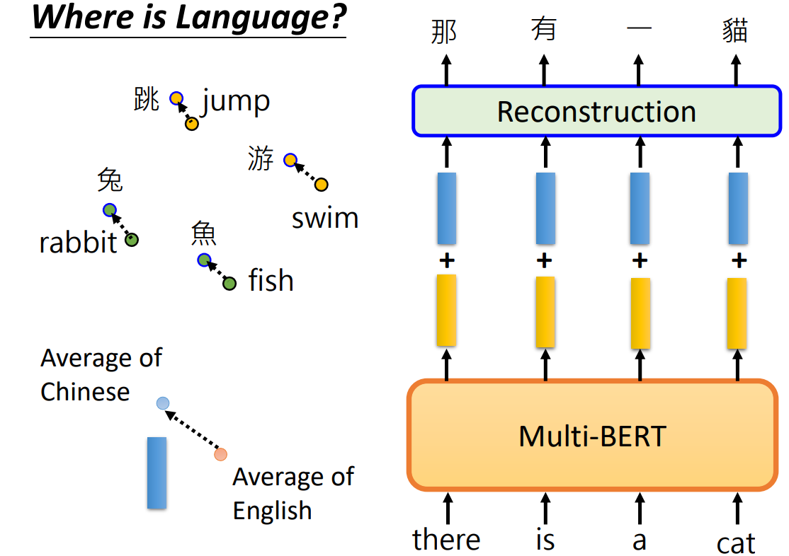

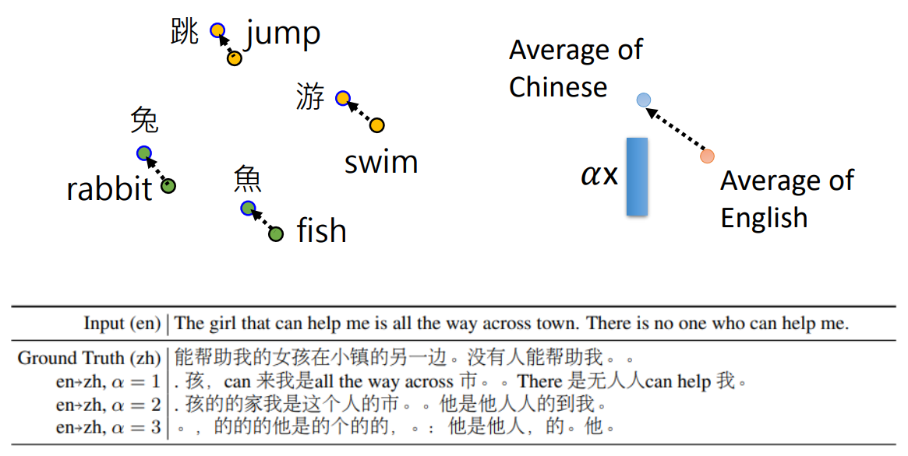

### Something about Bert

1. 如何评估预训练完成的 Bert？- General Language Understanding Evaluation (GLUE)
2. Bert 模型分析，他是何时知晓语义的？仍然是一个具有挑战性的课题。
3. Bert 不仅参数量巨大，预训练时还需要巨大的数据量。
4. 怎么 pre-train seq2seq 的 model？对输入做扰动，希望 Decoder 还原扰动。

## GPT

类似于 Transformer 中的 Decoder: **Predict Next Token**

### Fine-tune GPT (GPT-1)

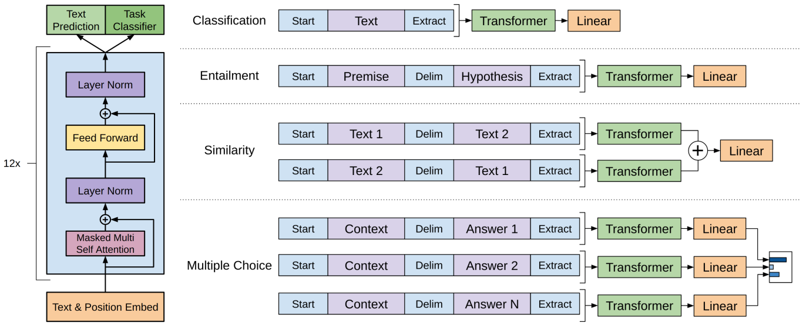

### Prompt

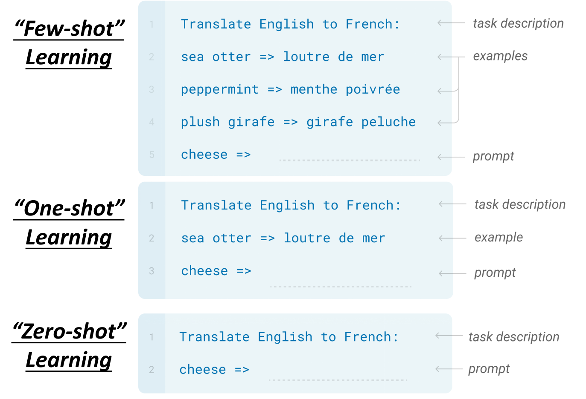

做到下游任务的时候，不需要下游任务的任何标注信息，那么也不需要去重新训练已经预训练好的模型。这样子的好处是只要训练好一个模型，在任何地方都可以用。

此时 GPT 的用法：使用 prompt 引导 gpt 去 **Predict Next Token**。
