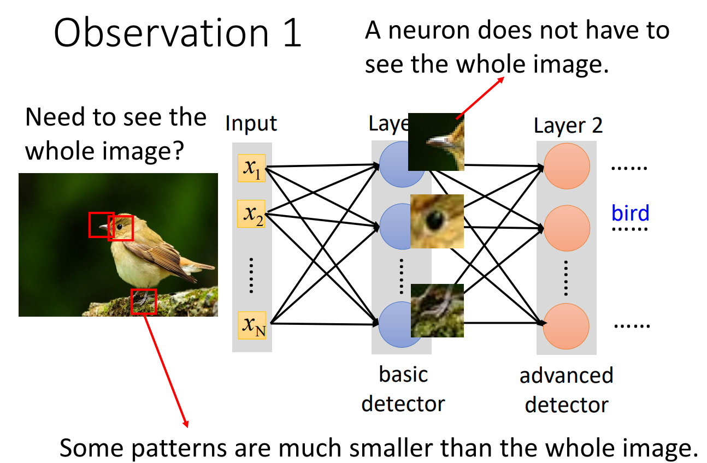
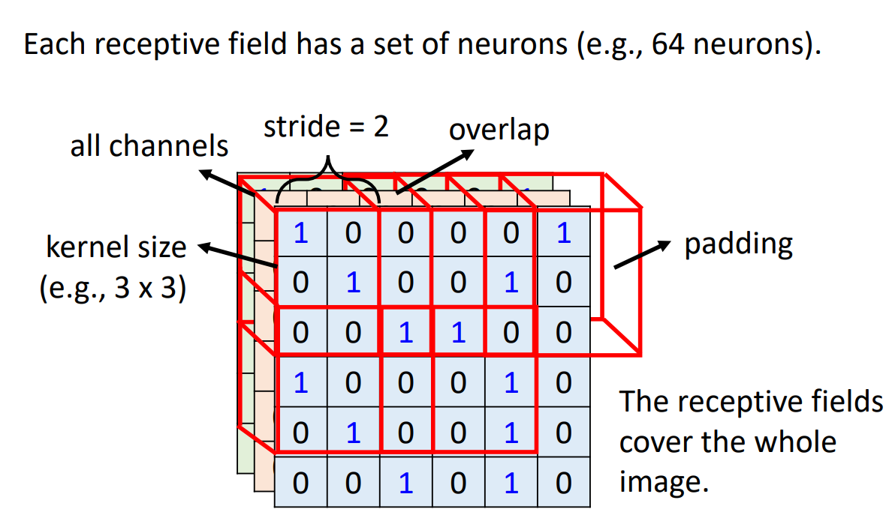
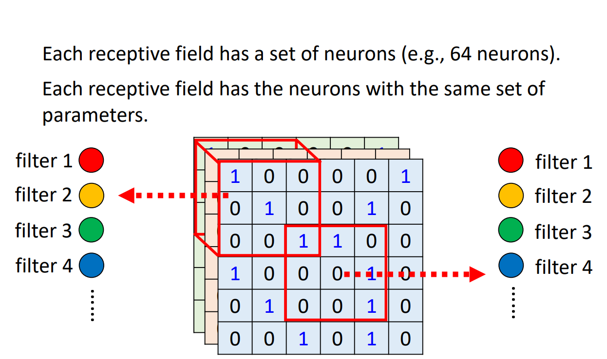
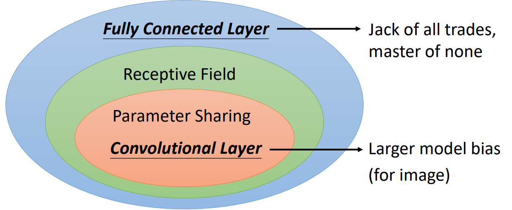
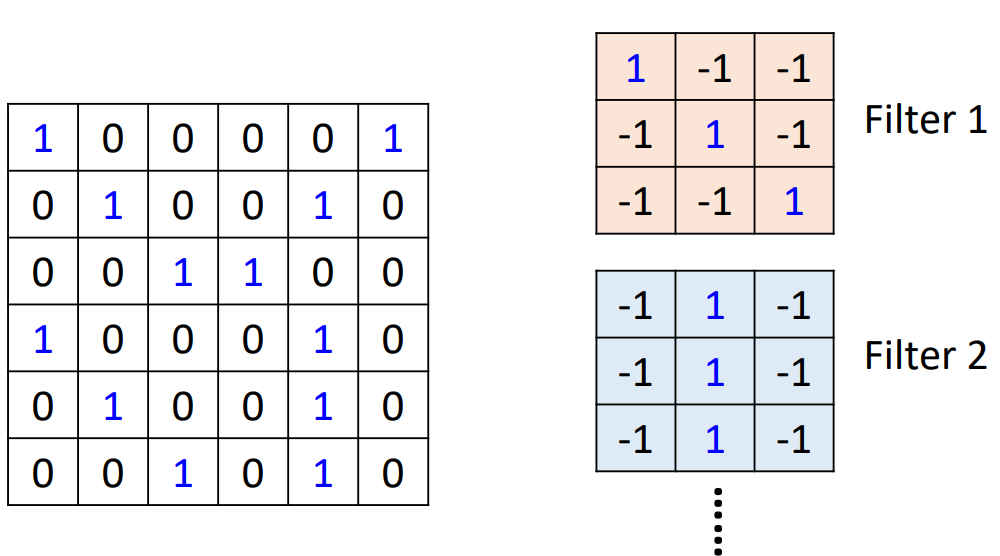
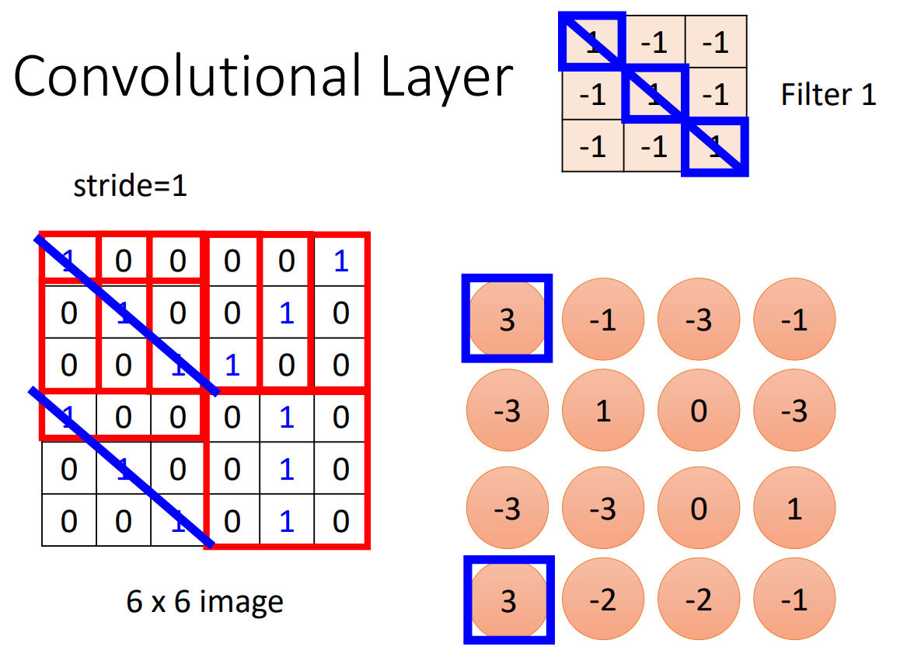
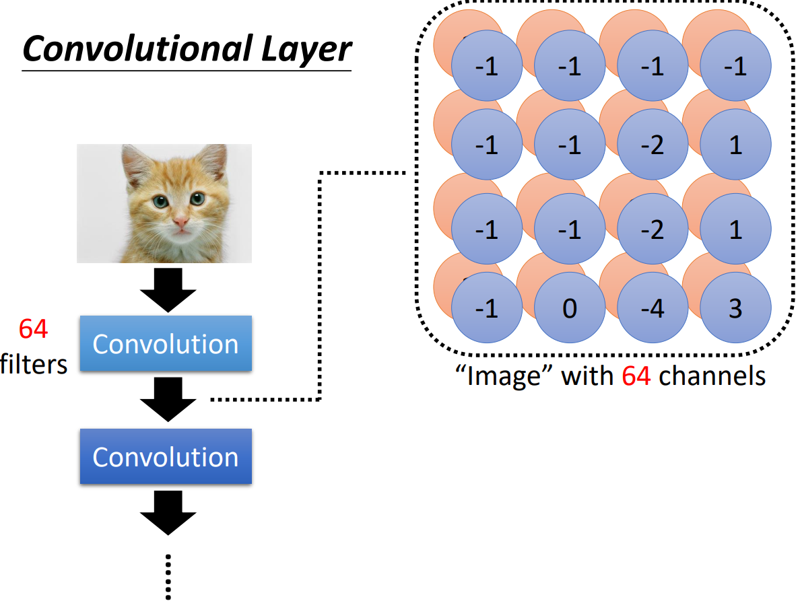
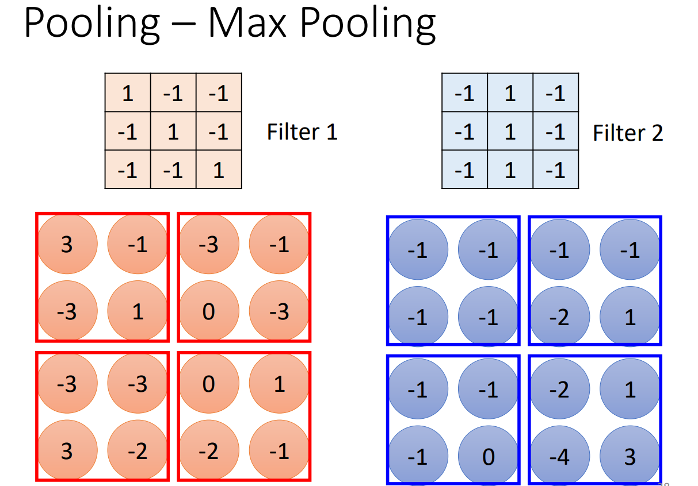
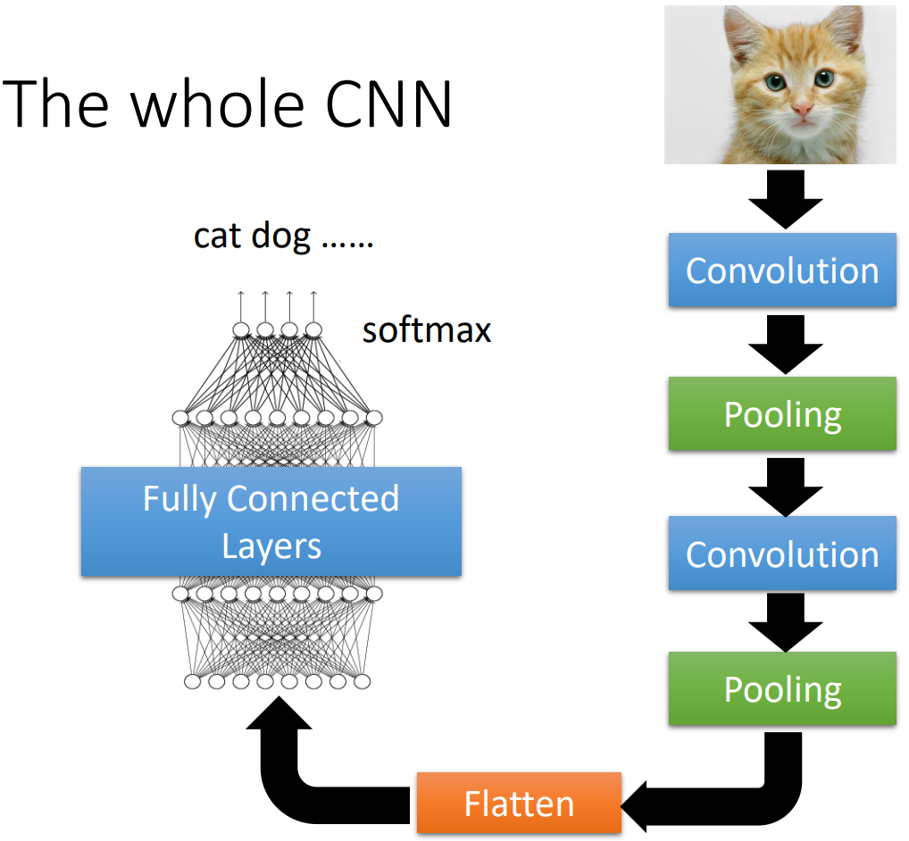
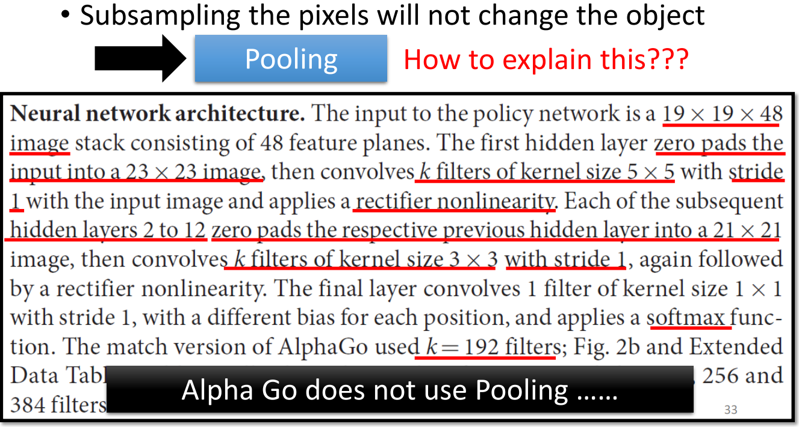

# Convolutional Neural Network
> 卷积神经网络 - 专门为影像设计的网络架构

## 理解方式一：基础的图像分类优化

基础的图像分类：
- 结果利用 one hot vector 表示类别
- 图像输入进行扁平化（vector）
  - RGB 色彩图像是一个 3D 的 Tensor，有红，绿，蓝三个 channel
  - 黑白图像是一个 2D 的矩阵，只有一个 channel
- 模型使用 Fully Connected Network

### 优化一：将图像按照 pattern 识别

> 像人一样，按照一张图上有特征的部分来识别一张图像

体现在神经网络的设计上，我们可以让一个神经元（neuron）负责一个 pattern，我们称其为 `Receptive Field` （感受野）

一个 Receptive Field 必定包含所有的 channel，其长宽则可以认为规定，将其长宽称为 kernel size，一般为 3 * 3 pixels。那么对于一个 RGB 图像，他的一个 Receptive Field 大小为 3 * 3 * 3。
- 一个 Receptive Field 可以被多个神经元所“观测”
- Receptive Field 们间可以有重叠，防止有 pattern 跨越在相邻但不相交的 Receptive Field 之间而被忽略

> kernel size 设置成 3 * 3 是不是太小了？后面我们会说到。

**经典的 Receptive Field 设计：**

- stride 一般设计成 1 或 2
- padding 时可以全设成 0，也有别的补值方法

### 优化二：参数共享（Parameter Sharing）

> 考虑到同一种 pattern 可能出现在图像不同的位置（绝对位置）

为了可以侦测这些出现在不同位置的同一种 pattern，可以将不同地方侦测一个 Receptive Field 的参数设置成一样的
- 这样的 neuron 遇到不同的图像产出的结果不同
- 这样的 neuron 遇到相同的图像产出的结果相同
- 观测同一个 Receptive Field 的 neuron 们不会共享参数（这就没意义了）

**经典的 Parameter Sharing 设计：**

- 分享有同样参数的 neurons 叫做 filter

## 什么是CNN

> 用到 卷积层（Convolutional Layer）的神经网络就叫 CNN

## 理解方式二：用 filter 理解 CNN

用不同的 filter 去图片里面“抓取”对应的 pattern
- 每个 filter 的大小一般为 3 * 3 * channel
- filter 参数一开始是不知道的

### 例子：如何使用 filter

假设我们有一个 6 * 6 的黑白图片，每个 filter 的大小为 3 * 3，stride 为 1：

我们用第一个 filter 扫过全图，并计算在每个区域上的元素积之和，可以得到一个 4 * 4 的新矩阵

类似地，我们用每个 filter 扫过全图，每个 filter 都可以得到一个 4 * 4 的矩阵，我们将这些新的矩阵形成的新的“图片”称为 Feature Map（特征图）。特征图的 channel 数为 filter 的数量

将第一层产生的特征图当成图片，再进行 convolution，得到一张长宽为 3 * 3 的特征图。如此重复下去……

> 所以我们不需要非常大的 kernel size，因为我们发现模型进行的越深，一个 filter 看的范围实际上是在变大的……

## 两种理解方式的总结

- 版本一的共享参数实际就是 filter。
- 不同的 Receptive field 用一组参数训练的过程实际就是 filter 扫图的过程，这就是 convolution

## 简化运算 - Pooling

我们发现对一张图片进行 subsampling（例如取偶数行奇数列组成一张图片），结果仍然可以被辨识，但这样可以大大减少机器运算量

我们可以用多种方法pooling，比如在 4 * 4 的特征图上，每 2 * 2 的区域选一个最大数，以此组成一张新的 2 * 2 的图片。这种 pooling 比较常用，我们叫他 Max Pooling

我们将卷积层和 pooling 反复交替使用，最后再扁平化后通过 soft-max，实现图像的分类识别：

> 随着算力的提生，图像识别对细节要求的增加，pooling 也变得可以选择有或者没有。

## 广义的“图像”

CNN是为影像设计，但不局限于图像识别。比如 Alpha Go：

围棋的特点：
- 我们用 5 * 5 的大小范围，就可以判断一片区域的局势
- 一种“局势”可能出现在棋盘的各个位置
- 棋盘可以表示为 tensor：
  - 长宽 19 * 19
  - 每个位置用 48 个 channel 表示这个位置的情况
- 下一个落子的位置实际就是一个“分类”问题

CNN 还能用在其它领域……

## CNN 的缺点

CNN无法处理影像方法旋转
- 可以做 data augmentation
- 利用 Spatial Transformer Layer（待续）