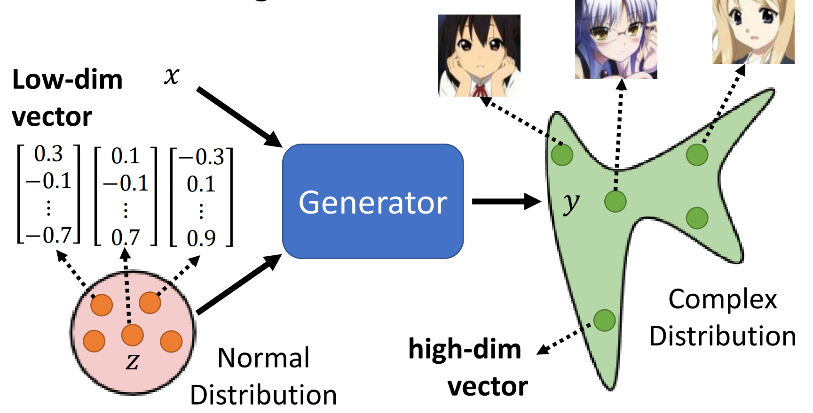

# GAN (Generative Adversarial Network)

## GAN

### Abstract (from the paper Generative Adversarial Nets)

We propose a new framework for estimating generative models via an adversarial process, in which we simultaneously train **two models**: a generative model G that captures the data distribution, and a discriminative model D that estimates the probability that a sample came from the training data rather than G. The training procedure for G is to maximize the probability of D making a mistake. This framework corresponds to a minimax two-player game. In the space of arbitrary functions G and D, a unique solution exists, with G recovering the training data distribution and D equal to $\frac{1}{2}$ everywhere. In the case where G and D are defined by multilayer perceptrons (MLP), the entire system can be trained with back-propagation.

### 生成式网络（区别于判别式网络）



训练一个 Generator 将一个简单分布（可以叫做噪音）应射到一个复杂分布（例如动漫人物的脸）
- 当输入还有一个 `x` 时，叫做 Conditional Generation
- 当输入没有 `x` 时，叫做 Unconditional Generation

### 如何确定损失？

最原始的想法：让 G 产生的分布和真是的分布尽量相近（两个分布之间的距离/散度尽量小）：

$$
G^* = arg \min_G Div(P_G, P_{data})
$$

问题是：我们没法计算这个 $Div$。但我们能做的是：从 $P_G$ 和 $P_{data}$ sample 数据

所以就有 Discriminator：
D 要使得 G 生成的数据得到一个尽可能小（等于 0）的数，使得 真实的 数据得到一个尽可能大（等于 1）的数。

$$
\begin{aligned}
D^* =& arg \max_D V(D, G)\\
=& arg \max_D (E_{x \sim p_{data}}[\log D(x)] + E_{z \sim p_z(z)}[\log(1 - D(G(z)))]
\end{aligned}
$$

这实际就是个二分类的 Cross Entropy 的相反数。

我们可以证明知，D 要优化的目标函数实际就是一种线性表示的 JS散度。我们就可以把 D 的目标函数同 G 的目标函数合并，得到（$p_z(z)$ 就是一个已知的噪音分布）：

$$
\min_G \max_D V(D, G) = E_{x \sim p_{data}}[\log D(x)] + E_{z \sim p_z(z)}[\log(1 - D(G(z)))]
$$

### 训练过程

```python
for epoch num:
    for k times: # k is a super-param
        sample m noise samples from p_g(z) # m is a super-param
        sample m samples from p_data
        # 直接把数据喂到 discriminator 中
        # 把 generator 和 discriminator 拼起来，冻结 generator 的参数进行优化
        update discriminator
    sample m noise samples from p_g(z)
    # 把 generator 和 discriminator 拼起来，冻结 discriminator 的参数进行优化
    update generator
```
