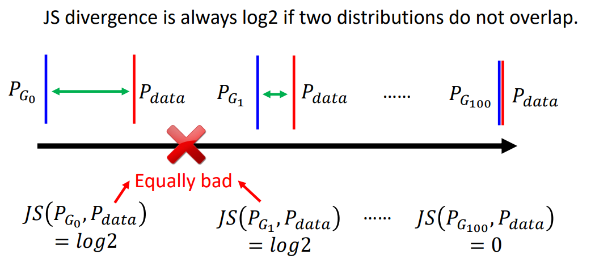

# GAN (Generative Adversarial Network)

## GAN

### Abstract (from the paper Generative Adversarial Nets)

We propose a new framework for estimating generative models via an adversarial process, in which we simultaneously train **two models**: a generative model G that captures the data distribution, and a discriminative model D that estimates the probability that a sample came from the training data rather than G. The training procedure for G is to maximize the probability of D making a mistake. This framework corresponds to a minimax two-player game. In the space of arbitrary functions G and D, a unique solution exists, with G recovering the training data distribution and D equal to $\frac{1}{2}$ everywhere. In the case where G and D are defined by multilayer perceptrons (MLP), the entire system can be trained with back-propagation.

### 生成式网络（区别于判别式网络）


训练一个 Generator 将一个简单分布（可以叫做噪音）应射到一个复杂分布（例如动漫人物的脸）
- 当输入还有一个 `x` 时，叫做 Conditional Generation
- 当输入没有 `x` 时，叫做 Unconditional Generation

### 如何确定损失？

最原始的想法：让 G 产生的分布和真是的分布尽量相近（两个分布之间的距离/散度尽量小）：

$$
G^* = arg \min_G Div(P_G, P_{data})
$$

问题是：我们没法计算这个 $Div$。但我们能做的是：从 $P_G$ 和 $P_{data}$ sample 数据

所以就有 Discriminator：
D 要使得 G 生成的数据得到一个尽可能小（等于 0）的数，使得 真实的 数据得到一个尽可能大（等于 1）的数。

$$
\begin{aligned}
D^* =& arg \max_D V(D, G)\\
=& arg \max_D (E_{x \sim p_{data}}[\log D(x)] + E_{z \sim p_z(z)}[\log(1 - D(G(z)))]
\end{aligned}
$$

这实际就是个二分类的 Cross Entropy 的相反数。

我们可以证明知，D 要优化的目标函数实际就是一种线性表示的 JS散度。我们就可以把 D 的目标函数同 G 的目标函数合并，得到（$p_z(z)$ 就是一个已知的噪音分布）：

$$
\min_G \max_D V(D, G) = E_{x \sim p_{data}}[\log D(x)] + E_{z \sim p_z(z)}[\log(1 - D(G(z)))]
$$

### 训练过程

```python
for epoch num:
    for k times: # k is a super-param
        sample m noise samples from p_g(z) # m is a super-param
        sample m samples from p_data
        # 直接把数据喂到 discriminator 中
        # 把 generator 和 discriminator 拼起来，冻结 generator 的参数进行优化
        update discriminator
    sample m noise samples from p_g(z)
    # 把 generator 和 discriminator 拼起来，冻结 discriminator 的参数进行优化
    update generator
```

## WGAN

### GAN 很难训练！

传统的 GAN 十分难 train。

首先，在大多数情况下，$P_G$ 和 $P_{data}$ 都是高维空间中的非常低维的一篇区域。例如：二维空间中的线。他们本身就很难相交。而且，我们的损失是通过抽样计算的，这可能让本就不怎么相交的 $P_G$ 和 $P_{data}$ 看起来更不相干。

同时，与 JS 散度相关的损失函数本身也有他的限制。当两个分布完全不相关时，JS 散度恒为 1。会出现下图的情况，就是模型明明进步了，但却看不出。



最后，JS 散度下的 Discriminator 也会出现一种现象就是每次都能 “分得很开”，即分类正确率很轻易就达到了 100%。

那么，我们

### Wasserstein distance

如果我们有一种距离，他也可以反映虽然毫不相干但是正在靠近的分布之间的距离变化就好了。这种距离就是 Wasserstein distance。

- Considering one distribution P as a pile of earth, and another distribution Q as the target
- The average distance the earth mover has to move the earth is Wasserstein distance

有了 Wasserstein distance，我们就可以很好的判断 G 是否有在进步了：


### WGAN

那么我们怎么在 GAN 中计算并利用 Wasserstein distance 进行优化呢？

Evaluate Wasserstein distance between $P_G$ and $P_{data}$:

$$
\max_{D \in {1-Lipschitz}} \{E_{y \sim P_{data}}[D(y)] - E_{y \sim P_{G}}[D(y)]\}
$$

要做大化这个式子，我们就要让 D 在 $P_{data}$ 上尽可能大，在 $P_G$ 上尽可能小。同时，因为 $D \in {1-Lipschitz}$（可以理解为 D 要足够平滑），所以可以做到反映 “距离”。

尽管如此，WGAN 也并非完美，后续还有很多在 WGAN 基础上进行优化的工作，比如 Improved WGAN，Spectral Normalization 等。

## GAN for Sequence Generation

GAN 也可以用于文本生成，例如我们可以将 Transformer 的 Decoder 作为 GAN 的 Generator：


但是我们在调整 Generator 的参数时，很可能会遇到如下情况：因为输出一个文字实际是一个分类问题，所以我们调整了参数可能不会改变输出的类别（字），不像图片。这样就算不了梯度了，怎么办呢？

一个方法就是用 reinforcement learning，用它去训练则不需要计算梯度。但是 GAN 本身就很难 train，再加上难 train 的 rl，就是难上加难了。

Google 提供了一种语言生成的 GAN，叫做 Training language GANs from Scratch

## Conditional Generation

### Text to Image

例如：我对一个动慢人物生成的 GAN Generator 输入一个条件指令，如 "Red hair"，我们希望他可以产生一个红头发的人物。

在训练时，我们需要的训练图片就需要是（图片-条件）成对的形式，将 条件 和 随机的噪音 一同喂入 Generator。
同时，在 Discriminator 工作时，我们也需要将 G(x) 和 label 同时输入。训练使得 Discriminator 只会给符合 label 的，成功生成动漫人物的 （图片-条件）对高分。


### Image translation (pix2pix)

除了文生图，我们还可以做到图生图，比如蓝图 -> 实物图。

在训练时，我们可以加入 supervised learning，如下：


只有 supervised learning 是不够的，因为他会得出一个 “平均值” 下的图像，所以图像是模糊的。
只有 Discriminator 也是不够的，因为 Generator 往往会过度 “具有创造力”，所以我们需要融合两种方法。

除了文生图，图生图，还有各种其他的生成方法。

## Learning from Unpaired Data

如果我们的资料不成对，连一对都没有，我们怎么学习呢？只能 Unsupervised Learning 了。

比如：图像风格转换：


## Cycle GAN


除了图片风格转换，我们还能做到比如 Text Style Transfer，将负面情绪的句子转换成负面情绪的句子。

完全套用 Cycle GAN，我们只需要将模型改成 Seq 的模型即可。因为 Seq2Seq 的模型接到 Discriminator 可能会有没法算梯度的问题，我们可以用 RL 进行优化。

除了以上应用，我们甚至可以做 Unsupervised 翻译，语音辨识等。

## Evaluation of Generation

说了这么多，我们似乎都在用人眼去评估 Generator 的性能好坏，有没有数字化的方式可以量化的评估我们的 Generator 呢？

**Quality of Image**

首先以图像生成为例，我们如何评估生成的图像的质量呢？有一种方法用到了一个图像分类器，如果对单个图像的分类结果向量越 “集中”，则可以证明这个图像越好（越真实）。

### Generator 会遇到的一些棘手的问题

**Mode Collapse**

但是只验证图片生成的质量远远不够，我们可能遇到 Mode Collapse 的情况：


也就是说，Generator 钻了 “空子”，一直在生成差不多一样的图片。

**Mode Dropping**

除了 Mode Collapse，我们还可能遇到 Mode Dropping：


以上两种问题都没有非常好的解决方法。

### Generator 评估分数

**Inception Score (IS)**

对于生成的一组图像，IS 将着眼于以下两个方面：

- 真实性（Fidelity）：通过在预训练的图像分类网络（通常是 Inception 网络）上计算生成图像的概率分布来评估。生成的图像越接近真实图像的分布（越集中），其分类结果越准确。
- 多样性（Diversity）：通过计算生成图像的类别分布的熵来评估。如果生成的图像涵盖了多个类别，并且每个类别的概率接近均匀分布，那么生成器具有较高的多样性。

**Fréchet Inception Distance (FID)**

FID 在评估图像生成的 Generator 时，取 softmax 前一层的结果作为表示这个图像的特征向量。然后其会将 $p_G$ 和 $p_{data}$ 视为两个高斯分布，计算其之间的 Fréchet distance。如果越小，则证明 $p_G$ 的分布越接近真实值。

除了以上的评估方法，Generator 还可能出现各种问题。比如产生反转的图片，甚至产生原图等。Generator 的评估仍然任重道远。
