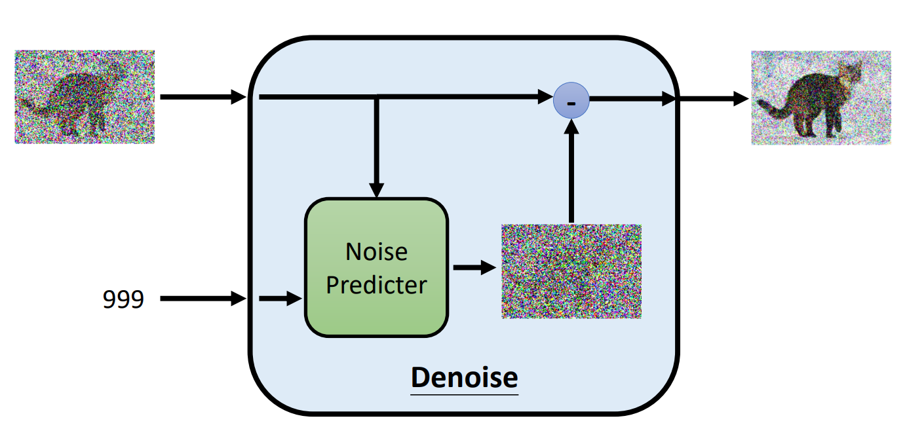

# 图像生成模型

## 图像生成

文字生成多采取 Autoregressive。如果图像生成参照文字生成的 Autoregressive 来做，可以挨个像素的生成，例如 Image-GPT。可是 Image-GPT 效率比较低。

若要参照文字生成的 Non-Autoregrssive 生成图像，容易导致每一个像素独立绘制，从而效果不好。

而考虑到图像生成的特性，我们输入一段文字时，常常有多种符合文字描述的图像（比如我们输入“一只狗跑步”，那么不管生成的图像中狗是什么品种的狗，都符合我们的预设）。设想我们的目标图像组成一个高维空间中的复杂分布，那么我们的建模过程如下：

模型输入有两个，一个是从已知分布（如高斯分布等）抽样出的噪音，一个是文字描述（可有可无）。我们的学习目标实际就是从噪音到图像的转换。

## 图像生成模型速览

下面简单介绍几种图像生成模型：

### Variational Auto-encoder (VAE)

VAE 由一个 Encoder 和一个 Decoder 组成。在使用他生成图像时只需要 Decoder 即可，Decoder 可以把抽样出的噪音向量转化成图像。在训练时，为了将噪音分布和目标图像分布关联，我们再引入 Encoder：做与 Decoder 相反的事。目标损失即是输入和输出图像的差异。为了保证 Encoder 输出向量是一个噪音向量，我们还需要对此进行一些限制。

### Flow-based Generative Model

训练一个 Invertible 的 Encoder。训练时将图片转换为已知分布的噪音，使用时反转即可使用。

### Diffusion Model

Diffusion 分为两个过程，Add noise 和 Denoise：

### GAN

以上的三种模型均可以与 GAN 共用，比如：
- [Diffusion-GAN: Training GANs with Diffusion](https://arxiv.org/abs/2206.02262)
- [Flow-GAN: Combining Maximum Likelihood and Adversarial Learning in Generative Models](https://arxiv.org/abs/1705.08868)

## Diffusion Model

### Denoise 是什么

Diffusion Model 产生图像的过程：对一张噪音不断 Denoise，最终生成图像。生成的步数是一个超参数。这个过程又被称为 Reverse Process：

实际上，上图中的每次 Denoise 用的 Denoise 模型都是同一个，为了让模型在应对不同程度的噪音时做出正确的动作，我们将 step 信息和待处理得图像共同输入 Denoise 块：

而 Denoise 内部的运作过程并不是一个简单地神经网络，其组成如下：

无法预测图像，就预测噪音。

### 如何训练 Noise Predictor

知道了 Denoise 的组成，现在问题就来到了如何训练 Noise Predictor，让他可以根据图像和 step（还有文字等）产生噪音。

不要忘了Diffusion 除了 Reverse Process 还有 Forward Process，即往图片中加噪音的过程。在加噪音的过程中，我们可以获得 step 和 ground truth。这时我们训练就有了 input 和 ground truth：

## Text-Condition Image Generation

文生图的基本 Framework：

