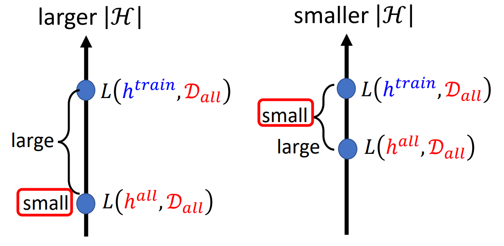

# 机器学习基础理论 & 为什么选择深度学习

## 机器学习基础理论

**机器学习模型基础三步：**
1. function with unknown
2. define loss
3. optimization

### 训练集的选择

我们将一个问题相关的所有的数据（世界上所有的数据，收集不齐）定义为 $D_{all}$，所有的可能的参数集为 $H$，我们在 $D_{all}$ 训练出的参数称为 $h^{all}$

$$
  h^{all} = arg \min_h L(h, D_{all})
$$

我们实际训练用的数据集 $D_{train}$ 是 $D_{all}$ 的子集。但是我们的训练集不一定能很好的“代表”总集。

我们希望：$L(h^{train}, D_{all})$ 和 $L(h^{all}, D_{all})$ 是很接近的。

上式可化为：
$$
  |L(h^{train}, D_{all}) - L(h^{all}, D_{all})| \le \delta
$$

可进一步化为：
$$
  \forall h \in H, |L(h, D_{train}) - L(h, D_{all})| \le \epsilon \\
  \epsilon = \delta / 2
$$

也就是说，好的训练集可以满足上式。那么如何让坏的的训练集减少，让我们的训练集是好的训练集的概率更大？

我们可以得出下式，训练集是坏的训练集的概率满足：
$$
  P(D_{train} is\ bad) \le |H| \cdot 2exp(-2N\epsilon^2)  \\ 
  N \ {\rm is \ the\ number \ of \ examples \ in} \ D_{train}
$$

所以为了让训练集更好，为了“现实”“理论”更加接近：
- $N$ 越大越好
- $H$ 越小越好

**但是** $H$ 越小，$h$ 可取的值也越少，$L(h^{all}, D_{all})$ 也不会很小

**也就是说** 
- Larger $N$ and smaller $|H|$ $\rightarrow$ $|L(h^{train}, D_{all}) - L(h^{all}, D_{all})| \le \delta$
- Smaller $|H|$ $\rightarrow$ Larger $L(h^{all}, D_{all})$

鱼与熊掌是否可以兼得？**YES, DEEP LEARNING**

## 为什么选择深度学习