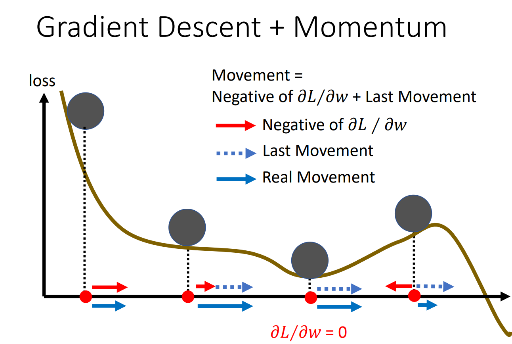
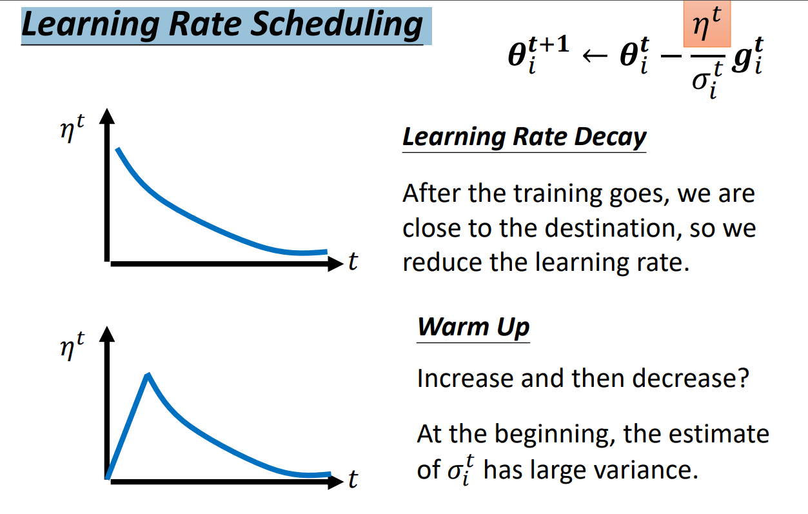

# 机器学习框架及问题解决

## 机器学习框架

1. **function with unknown parameters**
  $$
    y = f_ \theta (x)
  $$
2. **define loss from training data**
  $$
    L(\theta)
  $$
3. **optimization**
  $$
    \theta^* = arg \ {\rm min}_\theta L
  $$

## 如何解决模型遇到的问题

- **Training loss Large**
  - **model bias**
  - **optimization**
    - 用简单的模型了解 loss 是什么水平
    - 增加模型复杂度
- **Training loss small**
  -  **testing loss large**
     -  **overfitting**
        -  增加训练数据量
        -  data augmentation 翻转图片等
        -  简化模型 - 减轻弹性
     - **mismatch**
       - 优化数据结构，了解数据组成逻辑

### 模型复杂度如何权衡？

Split your training data into training set and validation set for model selection

### 克服 critical point 继续下降！-- 优化 optimization

> 局部最小值（local minima）与鞍点（saddle point）
> 梯度（gradient）为 0 的点，称为 critical point

**很多 critical point 都是 saddle point，我们可以去克服它，继续下降！**

#### 方法一：Batch

将一堆数据分成好几个 batch，经过一个 batch 就算一次 gradient，更新一次参数。

> 1 epoch = see all the batches once
> shuffle：一个 epoch 后打乱数据顺序，再进行新一轮 train

**Small Batch v.s. Large Batch:**
- Small Batch 在 training 上表现更好：更容易克服 saddle point，更容易到达“较平坦”的 local minima，从而 testing 结果也更好
- Small Batch 经过一个 epoch 更慢

#### 方法二：Momentum

沿梯度下降时，考虑之前走过的路径（获得“冲力”）

### 自动调整学习速率（Learning Rate）

为了更好的达到 critical point，在陡峭的地方走慢点，在平缓的地方走快点。为每个参数客制化学习速率。

**Training stuck ≠ Small Gradient**

#### Adam: RMSProp + Momentum

**RMSProp:** 对每个参数，针对不同的阶段，使用不同的学习速率参数。且可以指定对于现数据和之前数据的权重比。

从：
$$
  \theta_i^{t+1} \leftarrow \theta_i^{t} - \eta g_i^t
$$
到：
$$
  \theta_i^{t+1} \leftarrow \theta_i^{t} - \frac{\eta}{\sigma_i^t} g_i^t
  \\
  \sigma_i^t = \sqrt{\alpha(\sigma_i^{t-1})^2 + (1-\alpha)(g_i^t)^2}
$$

$\alpha$ 是 hyper parameter

**Adam:** 
$$
  \theta_i^{t+1} \leftarrow \theta_i^{t} - \frac{\eta}{\sigma_i^t} m_i^t
$$

$m_i^t$: Momentum: weighted sum of the previous gradients.

#### Learning Rate Scheduling

Learning Rate 随着时间（训练时间）自己改变。有以下两种主流方法：
