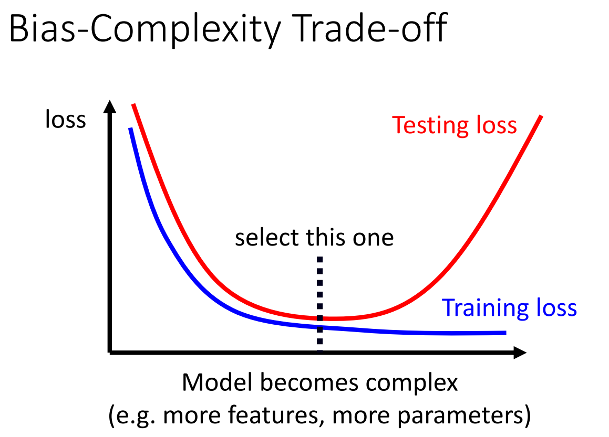

# 机器学习框架及问题解决

## 机器学习框架

1. **function with unknown parameters**
  $$
    y = f_ \theta (x)
  $$
2. **define loss from training data**
  $$
    L(\theta)
  $$
3. **optimization**
  $$
    \theta^* = arg \ {\rm min}_\theta L
  $$

## 如何解决模型遇到的问题

- **Training loss Large**
  - **model bias**
  - **optimization**
    - 用简单的模型了解 loss 是什么水平
    - 增加模型复杂度
- **Training loss small**
  -  **testing loss large**
     -  **overfitting**
        -  增加训练数据量
        -  data augmentation 翻转图片等
        -  简化模型 - 减轻弹性
     - **mismatch**
       - 优化数据结构，了解数据组成逻辑

### 模型复杂度如何权衡？

Split your training data into training set and validation set for model selection

