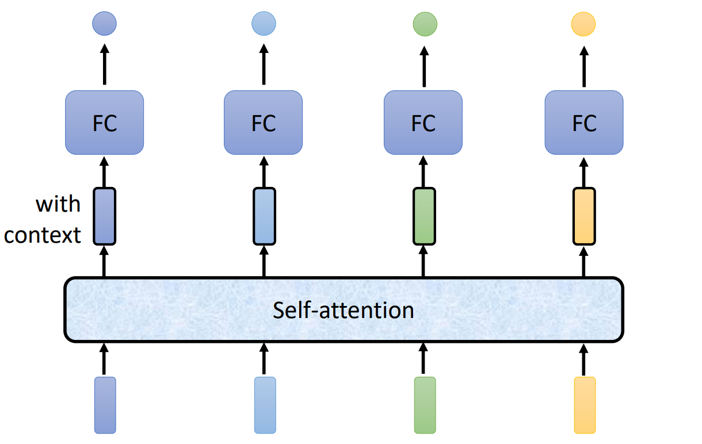
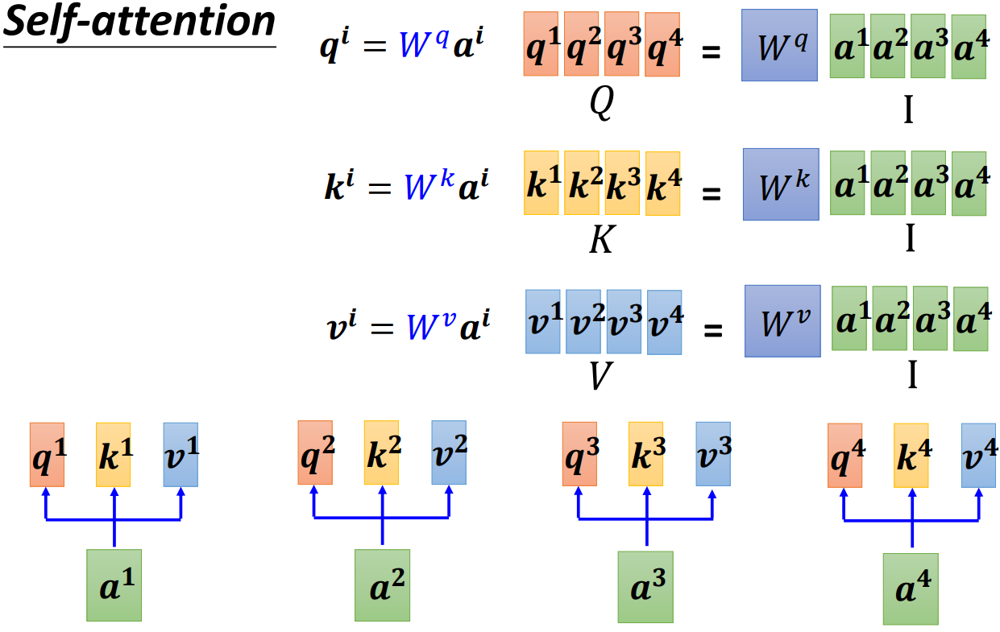
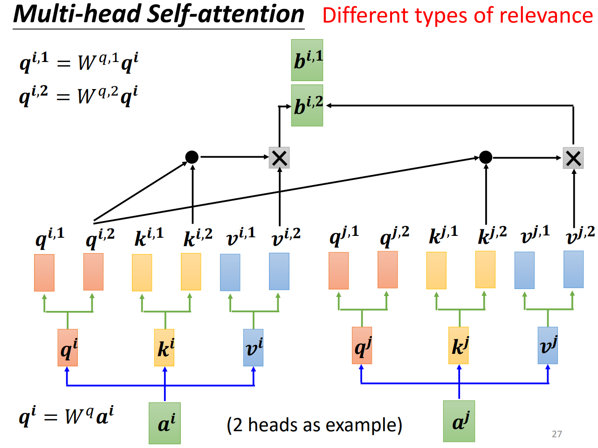
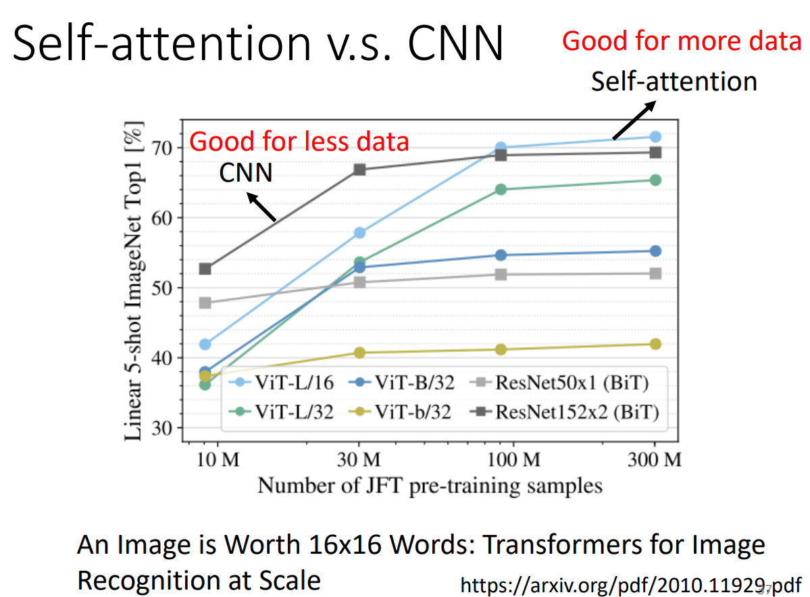

# Self-attention & Transform

## Vector Set as Input

- Input a sentence, where each words is a vector
- Input a voice, separated in 25ms frame, stride = 10ms
- Input a graph, where each nodes can be a vector

## What Is the Output of Vector Set?

- Each vector has a label
  - 例如：注音，分析每个单词词性等
- The whole sequence has a label
  - 例如：判断句子感情色彩，判断分子是否有毒性等
- Model decides the number of labels itself -- seq2seq
  - 例如：翻译

## 以 The whole sequence has a label 为例：什么是 self-attention

> 如果单纯的把单个向量处理的步骤应用到每个向量 -- 那上下文岂不是没有用了？如何才能去考虑向量集中所有（上下文）向量？

我们可以加上 Self-attention 层，每个向量经过计算后输出的向量都是包含了上下文信息的：

> Self-attention 层可以重复叠加 -- Can be either input or a hidden layer

### 一般的 Self-attention 算法

1. 每个向量 $a^i$ 都可以通过 $M_q \ M_k \ M_v$ 矩阵算出他们所对应的 $q^i \ k^i \ v^i$ 向量。
2. 当前向量的 $q^i$ 向量与所有向量的 $k^i$ 向量做点积得到 $\alpha _{i,i}$ 值。
3. 再将所有向量的 $v_i$ 向量与 $\alpha _{i,i}$ 值相乘后相加，得到 $b^i$。

- 从 A 矩阵到 A' 矩阵是对每列向量用了 soft-max 函数
- 要学习的参数只有 $W^q \ W^k \ W^v$ 三个矩阵的函数

### Multi-head Self-attention

为什么要 Multi-head ？
> “关系”可能有很多种类，一种种类的关系用一个 head 去解决：

- 相应种类的 head 用相应种类的向量解决。
- 得到的最终几个向量再拼接，再经过矩阵乘法，得到结果。

### Position Encoding

序列输入是有顺序的，我们如何将这些位置信息告诉 self-attention 层？
> 给不同位置的初始向量加上表示位置的向量 $e^i$ ，不同的位置用不同的向量：

由于是人为规定的，目前已经有很多不同的生成方法。

### Self-attention 应用场景

- transformer & BERT(NLP)
- 语音上用 self-attention
  - self-attention 不必要照顾所有的向量，只用在上下文一定范围内考虑
- 图像上用 self-attention
  - 把每个 pixel 看作 channel 维的向量

### Self-attention v.s. CNN

Self-attention 考虑整张图片，而 CNN 只考虑 receptive field 的范围

- Self-attention 是“复杂化”的 CNN：好像  receptive field 是被机器学出来的
- CNN 是 Self-attention 的一个 subset
  - CNN 弹性小，适合比较少的数据量
  - Self-attention 弹性大，比较少的数据量容易过拟合，但是上限高
  - 两者可以都用在一个模型

### Self-attention v.s. RNN

> RNN 基本可以被 Self-attention 取代了。

### Self-attention for Graph

只计算有 Edge 相连的向量之间的 attention ? -- GNN
