# Self-attention & Transformer

## Vector Set as Input

- Input a sentence, where each words is a vector
- Input a voice, separated in 25ms frame, stride = 10ms
- Input a graph, where each nodes can be a vector

## What Is the Output of Vector Set?

- Each vector has a label
  - 例如：注音，分析每个单词词性等
- The whole sequence has a label
  - 例如：判断句子感情色彩，判断分子是否有毒性等
- Model decides the number of labels itself -- seq2seq
  - 例如：翻译

## 以 The whole sequence has a label 为例：什么是 Self-attention

> 如果单纯的把单个向量处理的步骤应用到每个向量 -- 那上下文岂不是没有用了？如何才能去考虑向量集中所有（上下文）向量？

我们可以加上 Self-attention 层，每个向量经过计算后输出的向量都是包含了上下文信息的：

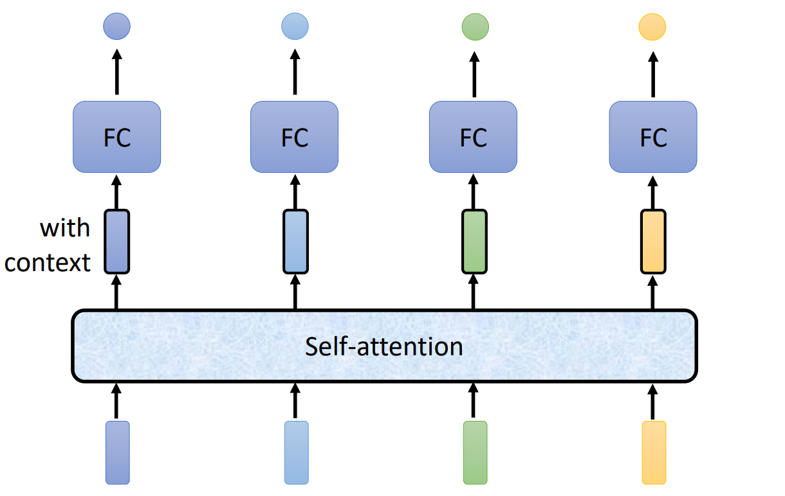

> Self-attention 层可以重复叠加 -- Can be either input or a hidden layer

### 一般的 Self-attention 算法

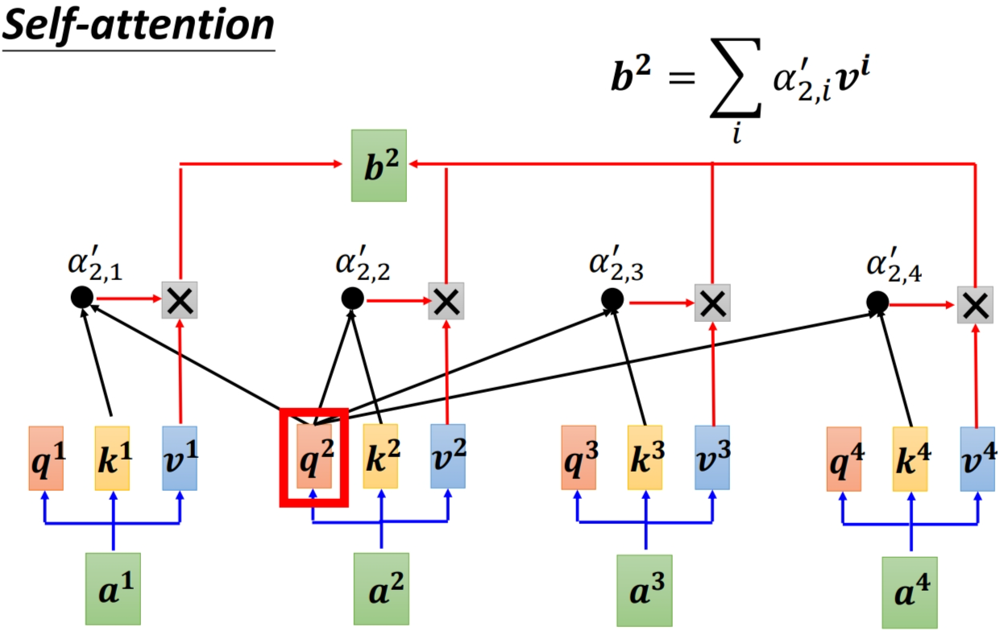

1. 每个向量 $a^i$ 都可以通过 $M_q \ M_k \ M_v$ 矩阵算出他们所对应的 $q^i \ k^i \ v^i$ 向量。
2. 当前向量的 $q^i$ 向量与所有向量的 $k^i$ 向量做点积得到 $\alpha _{i,i}$ 值。
3. 再将所有向量的 $v_i$ 向量与 $\alpha _{i,i}$ 值相乘后相加，得到 $b^i$。

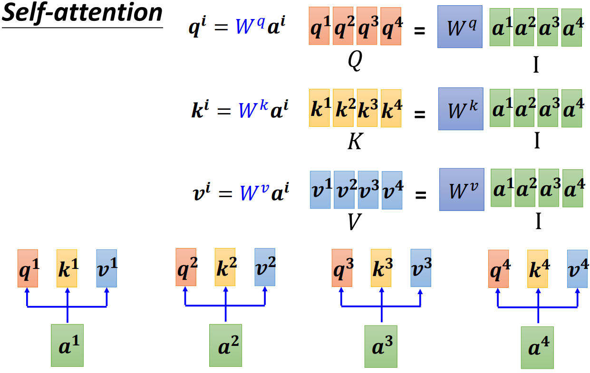

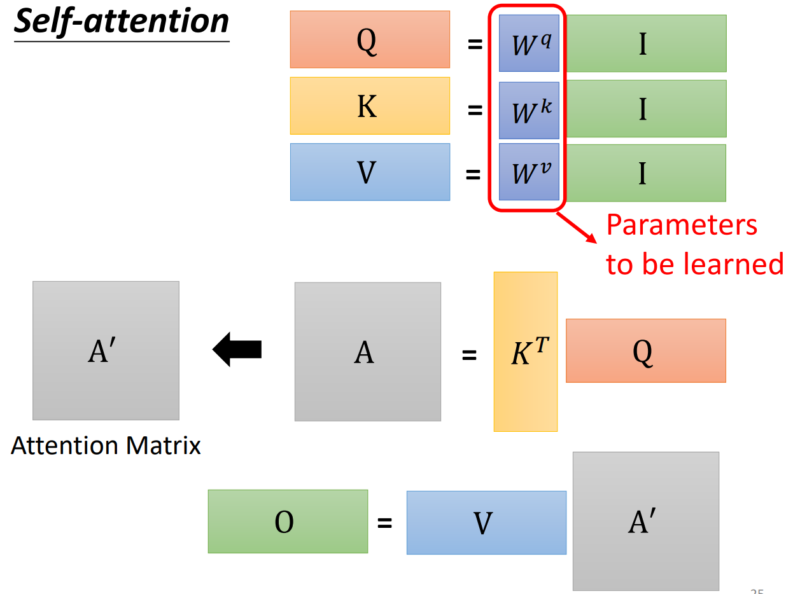

- 从 A 矩阵到 A' 矩阵是对每列向量用了 soft-max 函数
- 要学习的参数只有 $W^q \ W^k \ W^v$ 三个矩阵的函数

### Multi-head Self-attention

为什么要 Multi-head ？
> “关系”可能有很多种类，一种种类的关系用一个 head 去解决：

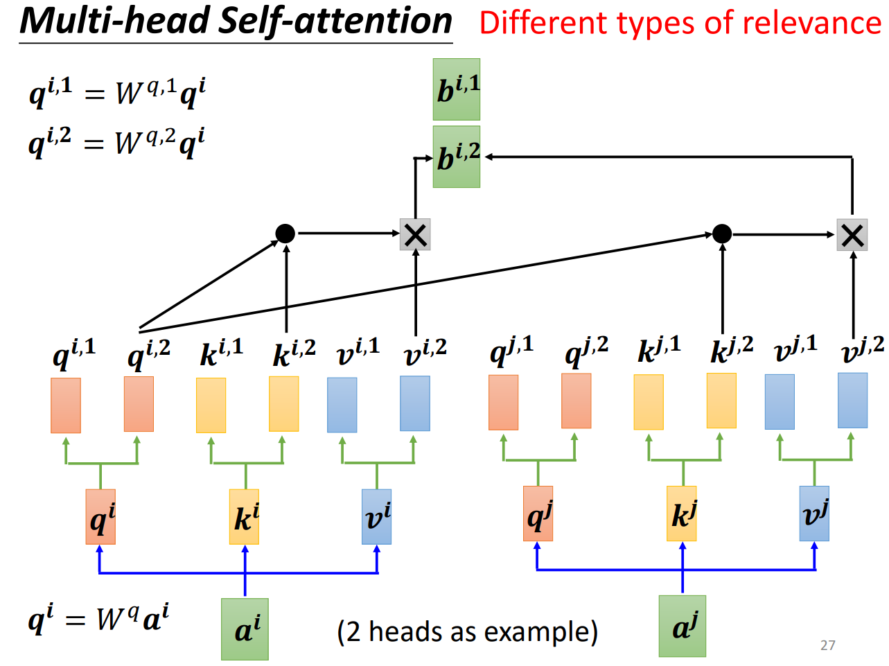

- 相应种类的 head 用相应种类的向量解决。
- 得到的最终几个向量再拼接，再经过矩阵乘法，得到结果。

### Positional Encoding

序列输入是有顺序的，我们如何将这些位置信息告诉 self-attention 层？
> 给不同位置的初始向量加上表示位置的向量 $e^i$ ，不同的位置用不同的向量：

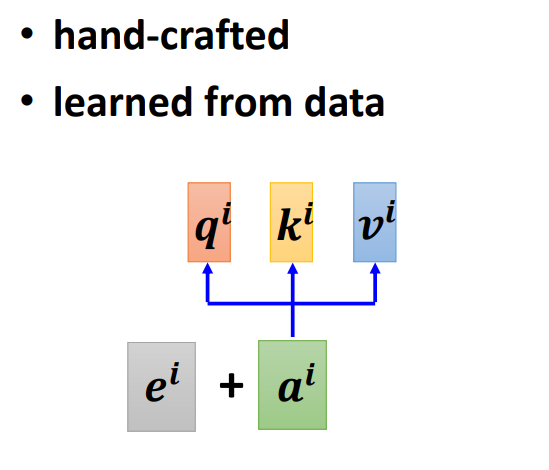

由于是人为规定的，目前已经有很多不同的生成方法。

### Self-attention 应用场景

- transformer & BERT(NLP)
- 语音上用 self-attention
  - self-attention 不必要照顾所有的向量，只用在上下文一定范围内考虑
- 图像上用 self-attention
  - 把每个 pixel 看作 channel 维的向量

### Self-attention v.s. CNN

Self-attention 考虑整张图片，而 CNN 只考虑 receptive field 的范围

- Self-attention 是“复杂化”的 CNN：好像  receptive field 是被机器学出来的
- CNN 是 Self-attention 的一个 subset
  - CNN 弹性小，适合比较少的数据量
  - Self-attention 弹性大，比较少的数据量容易过拟合，但是上限高
  - 两者可以都用在一个模型

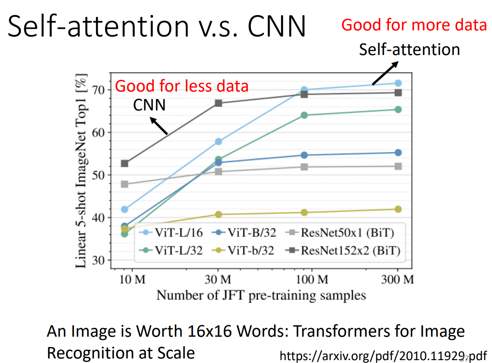

### Self-attention v.s. RNN

> RNN 基本可以被 Self-attention 取代了。

### Self-attention for Graph

只计算有 Edge 相连的向量之间的 attention ? -- GNN

## Seq2seq: Transformer

### 什么样的问题算是 Seq2seq 问题？

- Text <--> Speech
- Chatbot, QA
- Syntactic Parsing
  - `deep learning is very powerful` -> `(S (NP deep learning) (VP is (ADJV very powerful)))`
- Multi-label Classification
  - 一篇文章属于哪 **几个** 类别
- ...

### Transformer!

Transformer 基本结构：

Input sequence -> Encoder -> Decoder -> Output sequence

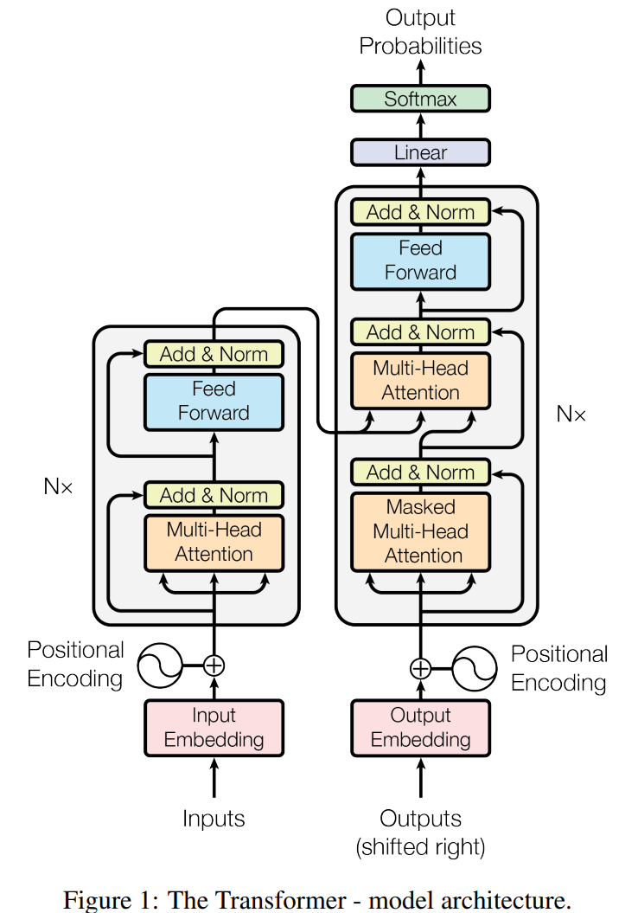

#### Encoder

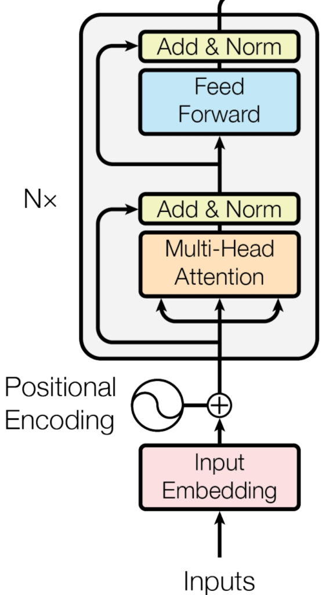

1. Inputs 先进行 Positional Encoding
2. 然后经过 Multi-Head Self Attention 层
3. 向量 $a$ 们经过 Attention 层 后得到 $b$，然后将两向量相加得到 $a + b$ 向量。这一过程称为 residual，在图中为 add。
4. 再将 $a + b$ 进行 Layer Normalize 操作，得到 $c$ 向量们
$$
x_i = \frac {x_i - m} {\sigma} \\
\text{mean} \ m , \  \text {standard deviation} \ \sigma 
$$
5. $c$ 向量们经过 fully connected layers，在进行 add & norm 操作
6. 将上述 1 ~ 5 步骤重复进行 N 遍。得到最终输出，至此 Encoding 结束

#### Decoder

两种主要的 Decoder -- 以语音辨识为例
- Autoregressive(AT)
- Non-Autoregressive(NAT)

##### 概览：什么是AT，什么是NAT

> Attention Is All You Need 这篇论文的 Decoder 是 AT

**AT：**

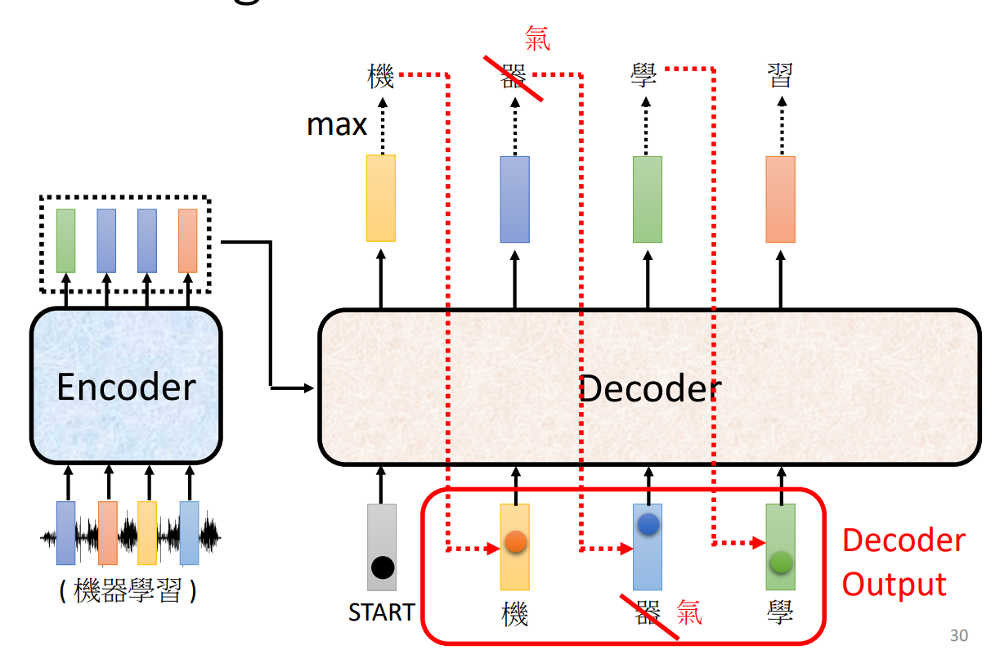

- 一个一个输出，前一个输出作为下一个输入
- 字是怎么出来的？有一个表包含了你要的所有结果，输出会是一个分类问题的 vector
- 怎么停下来？当我们将最后一个字作为输入进入 Decoder 时，输出一个 END 向量，来告诉 Decoder：结束了
- 有一个问题：会不会一步错步步错？后面会提到解决方法

**NAT：**

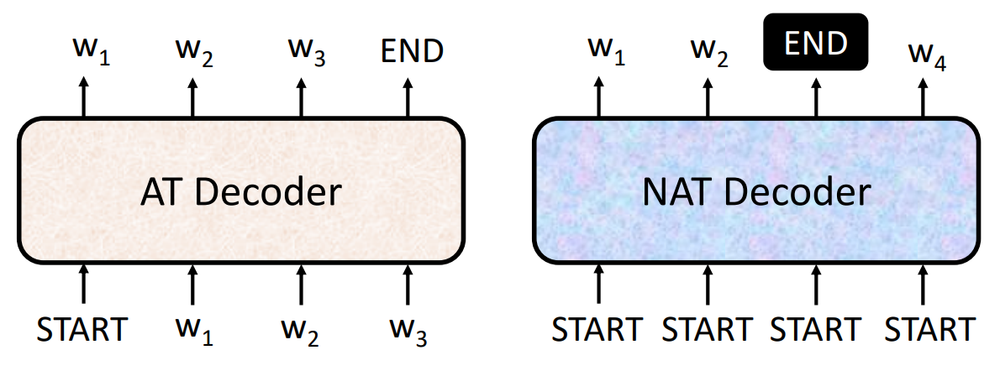

- NAT 是并行化的，该如何确定输出长度？
  - Another predictor for output length 
  - Output a very long sequence, ignore tokens after END
- NAT 的表现尚不如 AT
  
##### 重点理解：Autoregressive

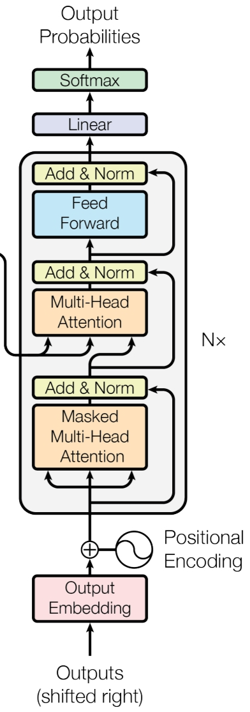

我们挡住中间的 cross-attention 部分，发现上下两部分很像 encoder

**什么是 Masked Self-attention**
因为输出向量是一个一个产生的，所以我们的 attention 只考虑已经产生的向量：
$a_i$ 考虑 attention 只考虑它自身及已输出的向量

**什么是 cross-attention**

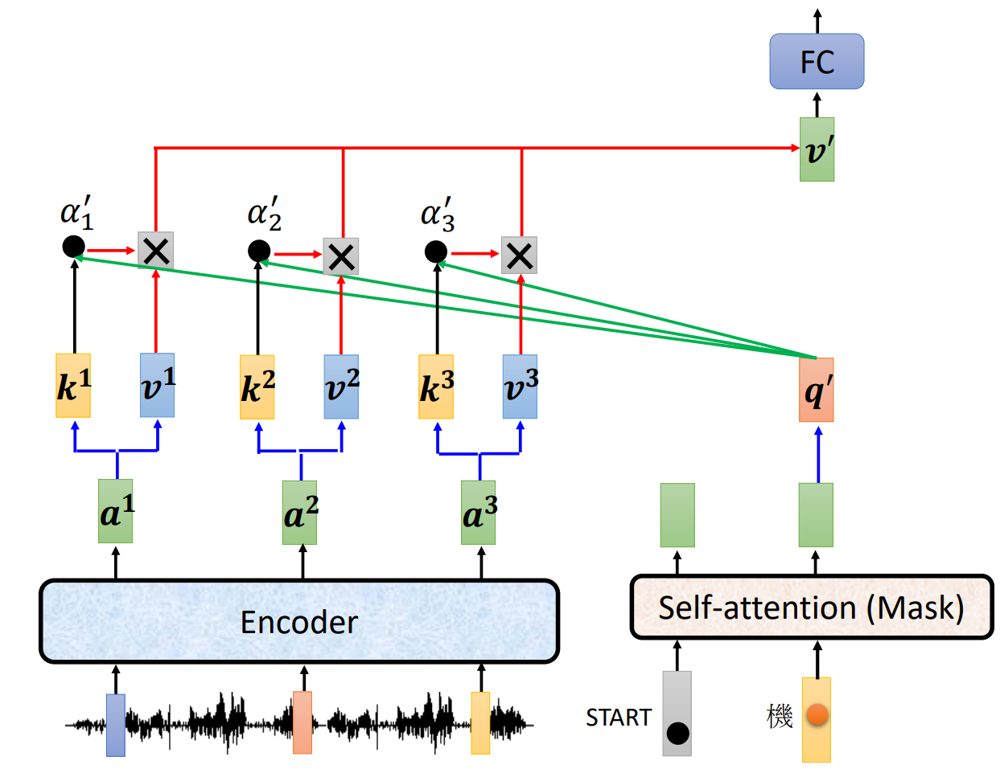

- cross-attention 的 key 一般都是 encoder 的最终输出们

### 如何训练 transformer？

- Loss Function 用 cross-entropy
- Teacher Forcing: using the ground truth as input (while training)
  - 为了防止一步错，步步错，我们在训练时可以故意加入一些同音字等

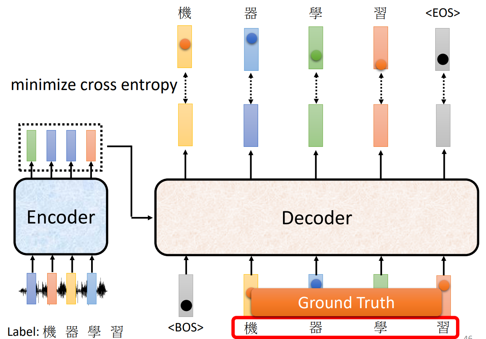

### 一些 Tips

**Guided Attention**
强迫 attention 有个固定的结构（由左向右等）

**Beam Search**
在 **一些** 任务上可以选出一条很好的输出路径（随机性小）
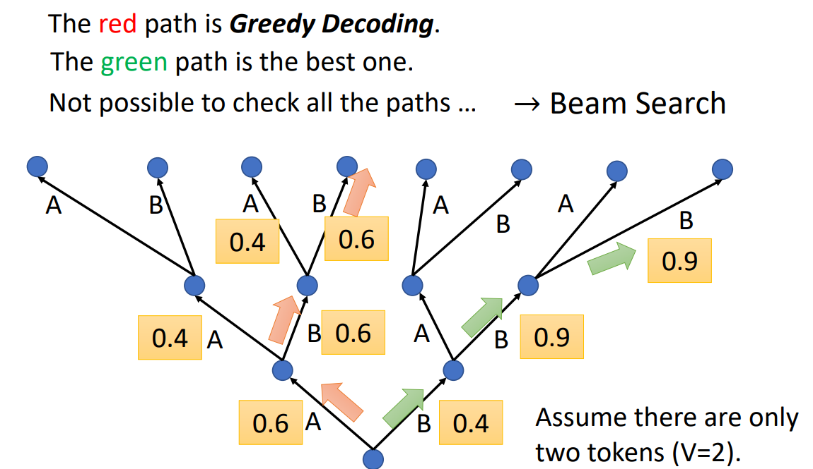

**BLEU score**
- BLEU score 用来 validation，他计算的是两个 sequence 之间的相似程度，但是不宜用来训练，因为不好微分
- cross-entropy 用来计算每个 vector 和正确答案之间的 loss，可能和上者有一定出入。但是好微分，训练时我们选择 cross-entropy 
