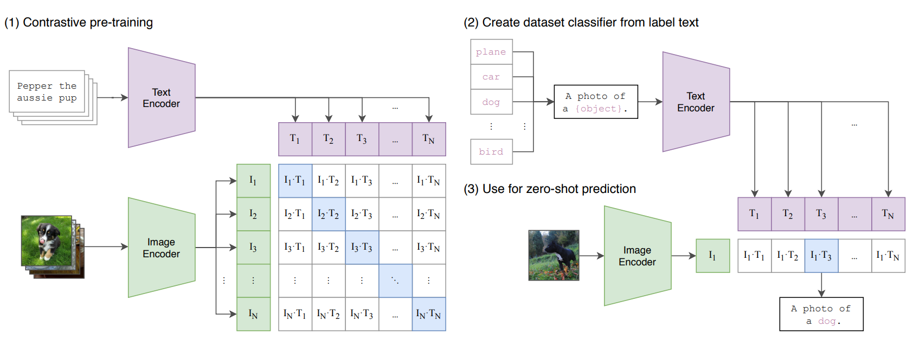
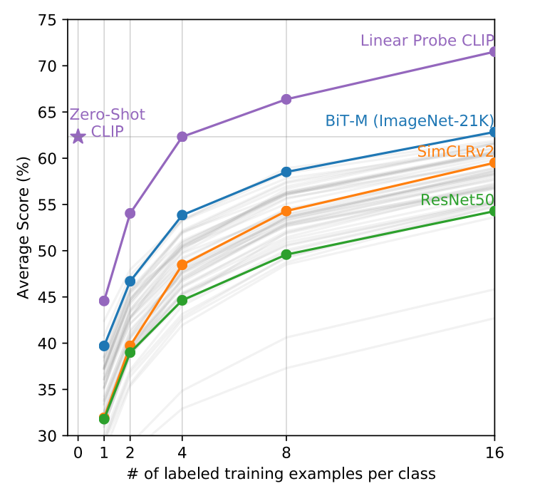
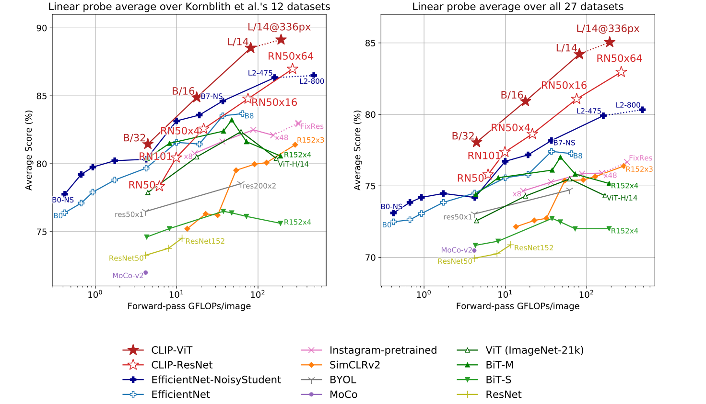

# Clip

仅利用自然语言的监督信号训练出的大模型

---



CLIP jointly trains an image encoder and a text encoder to predict the correct pairings of a batch of (image, text) training examples. At test time the learned text encoder synthesizes a zero-shot linear classifier by embedding the names or descriptions of the target dataset’s classes.

## Approach

### Using Contrastive Learning

直接预测文本有难度。并且根据最近对比学习领域的结论，对比式的学习和直接预测文本表现想当时，前者需要的计算资源更少。

最终目标：

Given a batch of N (image, text) pairs, CLIP is trained to predict which of the N ×N possible (image, text) pairings across a batch actually occurred. 

To do this, CLIP learns a multi-modal embedding space by jointly training an image encoder and text encoder to 
- **maximize the cosine similarity of the image and text embeddings of the $N$ real pairs** 
- **minimizing the cosine similarity of the embeddings of the $N^2 - N$ incorrect pairings**.

We optimize a symmetric cross entropy loss over these similarity scores.

### Tips of Training

1. Using only a linear projection to map from each encoder’s representation to the multi-modal embedding space. We did not notice a difference in training efficiency between the two versions.
2. A random square crop from resized images is the only data augmentation used during training.
3. the temperature parameter which controls the range of the logits in the softmax, $τ$, is directly optimized during training as a log-parameterized multiplicative scalar to avoid turning as a hyper-parameter.

### Training Process

```python
# image_encoder - ResNet or Vision Transformer
# text_encoder  - CBOW or Text Transformer
# I[n, h, w, c] - minibatch of aligned images
# T[n, l]       - minibatch of aligned texts
# W_i[d_i, d_e] - learned proj of image to embed
# W_t[d_t, d_e] - learned proj of text to embed
# t             - learned temperature parameter

# extract feature representations of each modality
I_f = image_encoder(I) #[n, d_i]
T_f = text_encoder(T) #[n, d_t]

# joint multimodal embedding [n, d_e]
I_e = l2_normalize(np.dot(I_f, W_i), axis=1)
T_e = l2_normalize(np.dot(T_f, W_t), axis=1)

# scaled pairwise cosine similarities [n, n]
logits = np.dot(I_e, T_e.T) * np.exp(t)

# symmetric loss function
labels = np.arange(n)
loss_i = cross_entropy_loss(logits, labels, axis=0)
loss_t = cross_entropy_loss(logits, labels, axis=1)
loss = (loss_i + loss_t)/2
```

## Experiments

### Zero-shot Transfer

It highlights the importance of studying zero-shot transfer as a measure of task-learning capabilities, rather than just representation learning in traditional CV, which you need to fine-tune the model towards down-stream tasks.

### Prompt Engineering

Prompt issue:
- Polysemy
- prompt as a sentence or a word -> distribution gap

Solutions:
- prompt template “A photo of a {label}.”
- Several fine-grained image classification datasets that it helped to specify the category. For example on Oxford-IIIT Pets, using “A photo of a {label}, a type of pet.”
- On ImageNet, we ensemble 80 different context prompts and this improves performance by an additional 3.5% over the single default prompt discussed above.

### Zero-shot & Few-shot performance on classification

**Zero-shot**

- Zero-shot CLIP performed nice on simple/individual object dataset such as OxfordPets and Birdsnap.
- Zero-shot CLIP is quite weak on several spe-
cialized, complex, or abstract tasks such as satellite image classification (EuroSAT and RESISC45), lymph node tumor detection (PatchCamelyon), counting objects in synthetic scenes (CLEVRCounts), self-driving related tasks such as German traffic sign recognition (GTSRB), recognizing distance to the nearest car (KITTI Distance).

**Few-shot** Using Linear Probe.



### Representation Learning



## Limitation

- 单纯扩大数据集 / 规模 -> 训练难度太大，目前不可行
- 在细分类任务，数物体等更抽象的任务，Clip 做的不好
- Clip 需要被给类别，没法生成 caption
- 数据集还是太大，数据利用效率太低
- 有没有专门用来 zero-shot 的数据集？
- Few-shot 有时甚至不如 Zero-shot

## Conclusion

We have investigated whether it is possible to transfer the success of task-agnostic（对不同的任务能“一视同仁”） web-scale pre-training in NLP to another domain. We find that adopting this formula results in similar behaviors emerging in the field of computer vision and discuss the social implications of this line of research. In order to optimize their training objective, CLIP models learn to perform a wide variety of tasks during pre-training. This task learning can then be leveraged via natural language prompting to enable zero-shot transfer to many existing datasets. At sufficient scale, the performance of this approach can be competitive with task-specific supervised models although there is still room for much improvement.
