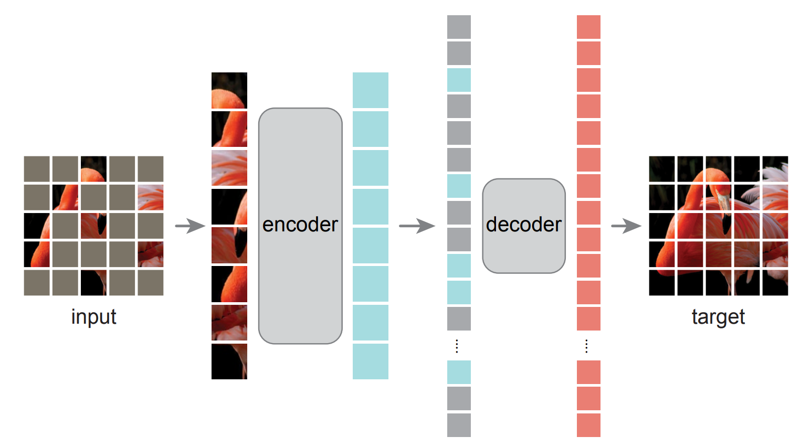

# MAE (Masked Auto-encoder)

Auto-encoder：`Auto` 指 `Self`

---

**MAE 可以理解为 CV 版本下的 Bert**

## Architecture

During pre-training, a large random subset of image patches (e.g., 75%) is masked out. The encoder is applied to the small subset of visible patches. Mask patches are introduced after the encoder, and the full set of encoded patches and mask patches is processed by a small decoder that reconstructs the original image in pixels. After pre-training, the decoder is discarded and the encoder is applied to uncorrupted images (full sets of patches) for recognition tasks.

## Approach

启发自 Bert，做完形填空。问题一：如何 mask？

> 为了防止模型通过简单地插值解决问题，我们选择删去高对比的 patches。并且大量（75%）地删去。选择方法是随机抽样。

问题二：Encoder 是什么？

> 为了迎合 masking 的方法，Encoder 用 CNN 显然是不如 ViT 来的直接的。我们只需要将没有 masked 的 patches 线性投影，位置编码后作为词输入 ViT 即可。

问题三：Decoder 如何工作？

> 因为需要还原的是像素，肯定不能简单地用几个全连接层。所以 Decoder 也使用 ViT 实现。此时输入 Decoder 的是 Encoder 的结果和所有 masked patches。所有 masked patches 将被转换为一个可学习的 vector。最后，所有 Decoder 的输入 vector 再进行位置编码，进入 ViT。

问题四：如何训练？

> Loss 即为预测的像素和已知像素之间的 MSE。只用计算 masked patches 中的即可。
