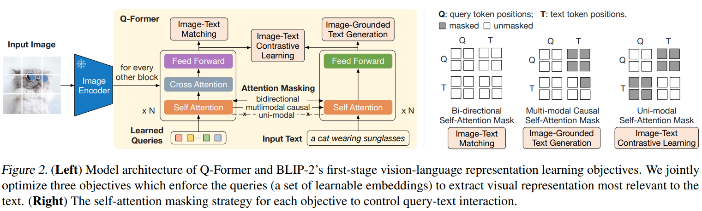
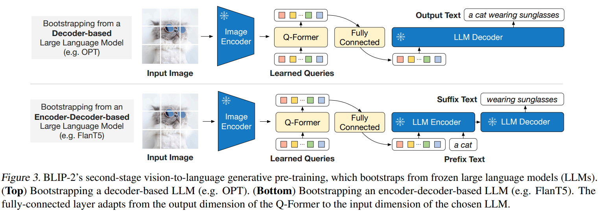
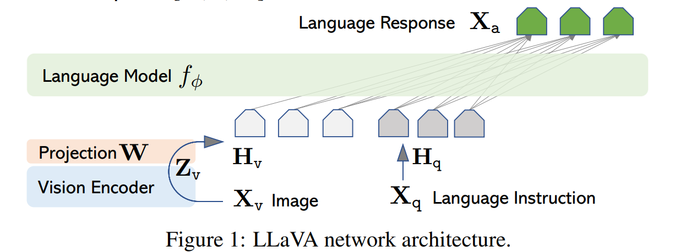
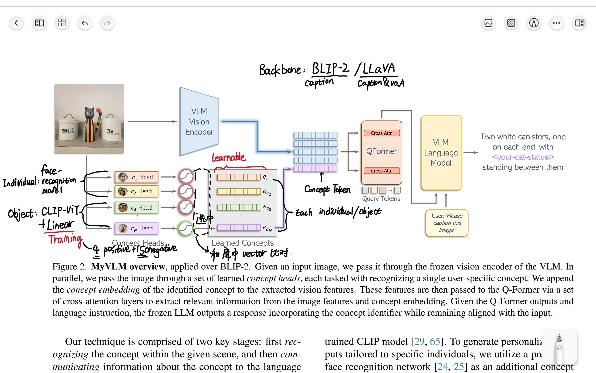

# MyVLM: Personalizing VLMs for User-Specific Queries

## Preliminaries

### BILP-2 （Q-Former）

3 components:
1. a pretrained ViT-L/14 vision encoder
2. a pretrained language model
3. a trainable Querying Transformer (Q-Former) model tasked with bridging the vision-language modality gap.

### LLaVA: Large Language and Vision Assistant

#### Architecture

3 components:

1. a pre-trained CLIP visual encoder ViT-L/14
2. a simple linear layer $W$ to connect image features into the word embedding space
3. a LLaMA

#### GPT-assisted Visual Instruction Data Generation

[TODO]

## Abstract

Recent large-scale vision-language models (VLMs) have demonstrated remarkable capabilities in understanding and generating textual descriptions for visual content. However, these models lack an understanding of user-specific concepts. In this work, we take a first step toward the personalization of VLMs, enabling them to learn and reason over user-provided concepts. For example, we explore whether these models can learn to recognize you in an image and communicate what you are doing, tailoring the model to reflect your personal experiences and relationships. To effectively recognize a variety of user-specific concepts, we augment the VLM with external concept heads that function as toggles for the model, enabling the VLM to identify the presence of specific target concepts in a given image. Having recognized the concept, we learn a new concept embedding in the intermediate feature space of the VLM. This embedding is tasked with guiding the language model to naturally integrate the target concept in its generated response. We apply our technique to BLIP-2 and LLaVA for personalized image captioning and further show its applicability for personalized visual question-answering. Our experiments demonstrate our ability to generalize to unseen images of learned concepts while preserving the model behavior on unrelated inputs.

