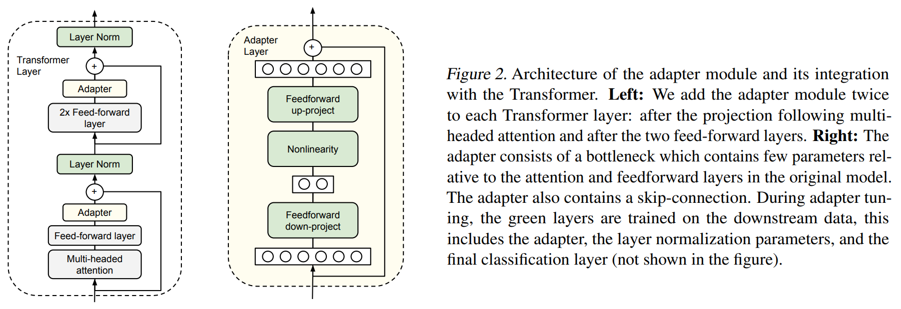
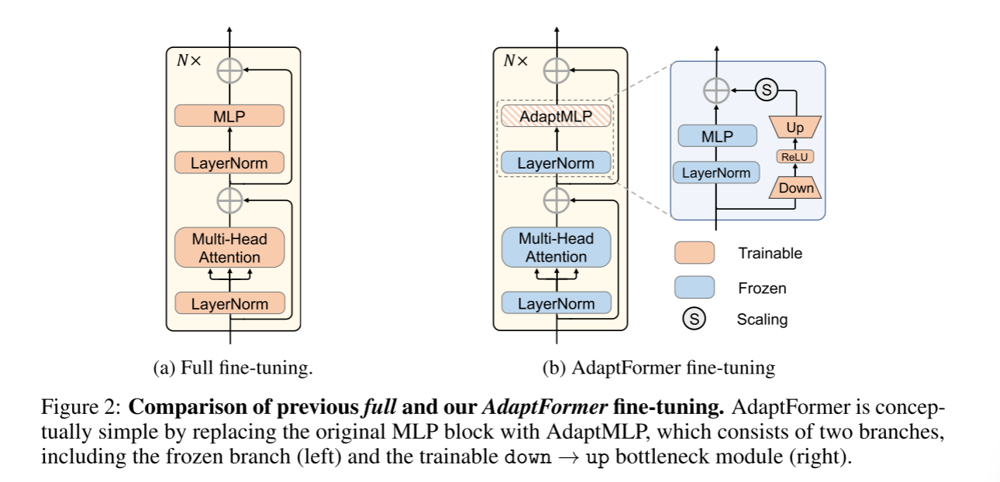
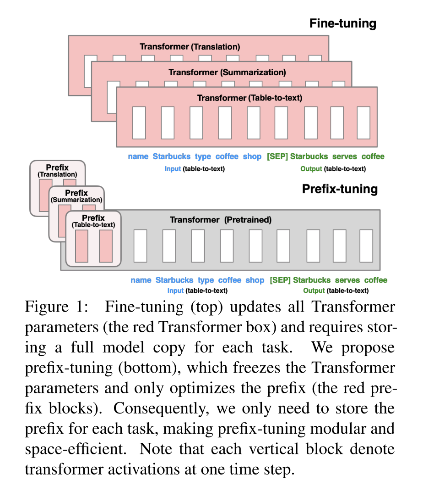
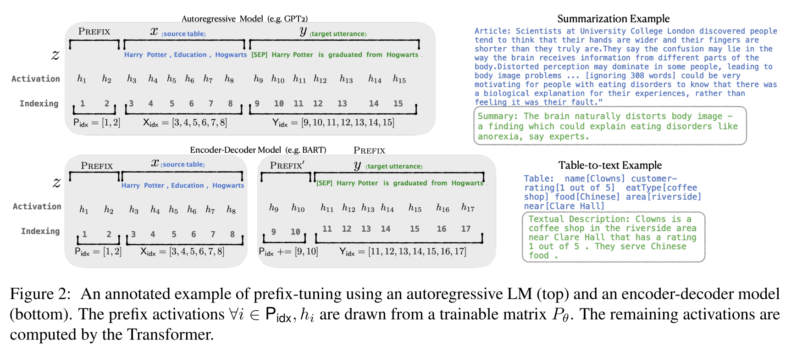
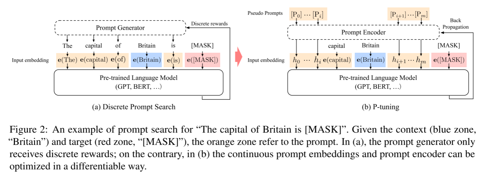
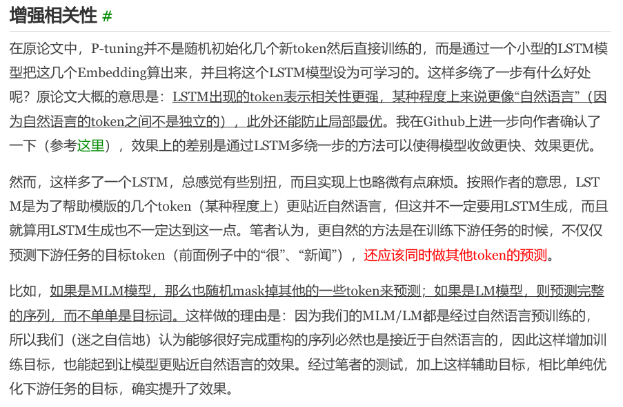
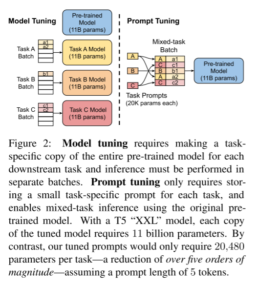
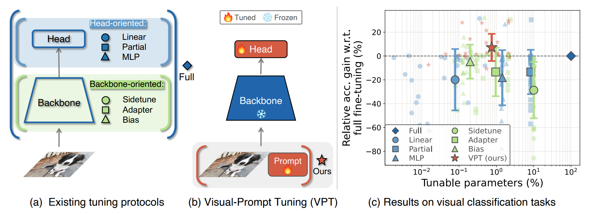
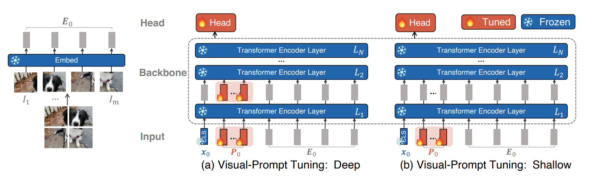
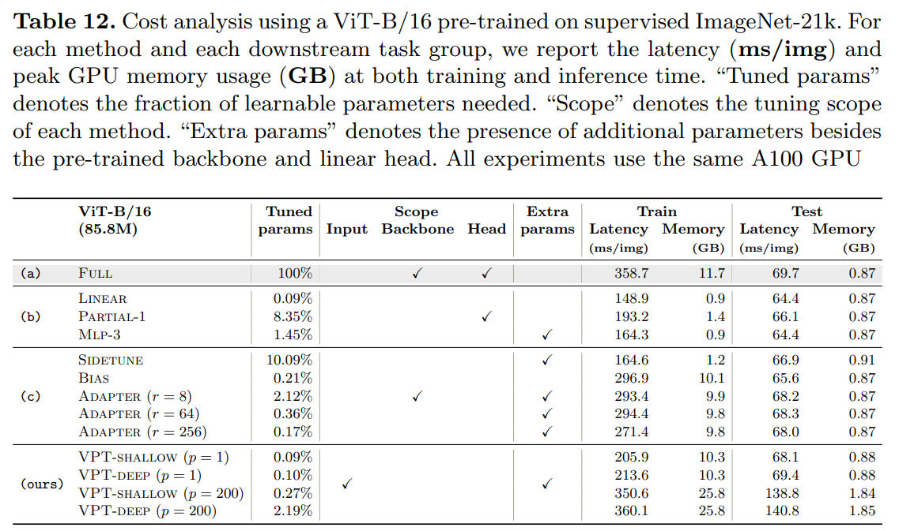

# Brief Description of PEFT

## Adapter-based

### Parameter-Efficient Transfer Learning for NLP (13 June 2019)

#### Abstract

Fine-tuning large pre-trained models is an effective transfer mechanism in NLP. However, in the presence of many downstream tasks, fine-tuning is parameter inefficient: an entire new model is required for every task. **As an alternative, we propose transfer with adapter modules.** Adapter modules yield a compact and extensible model; they add only a few trainable parameters per task, and new tasks can be added without revisiting previous ones. The parameters of the original network remain fixed, yielding a high degree of parameter sharing. To demonstrate adapter’s effectiveness, we transfer the recently proposed BERT Transformer model to 26 diverse text classification tasks, including the GLUE benchmark. Adapters attain near state-of-the-art performance, whilst adding only a few parameters per task. On GLUE, we attain within 0.4% of the performance of full fine-tuning, adding only 3.6% parameters per task. By contrast, fine-tuning trains 100% of the parameters per task.

#### Notes

- A skip-connection is employed inside the adapter network such that if the parameters of the projection layers are near zeros, the adapter module approximates an identity function.
- During adapter tuning, only the parameters of the adapters, the normalization layers, and the final classification layer are updated.
- During training, the adapters may then be activated to change the distribution of activations throughout the network.

#### Computational Cost

- classification with BERT: All runs are trained on 4 Google Cloud TPUs with a batch size of 32.
- The following command provides an example of tuning with adapters on GLUE. Fine-tuning may be run on a GPU with at least 12GB of RAM, or a Cloud TPU
- For each task, we run AutoML for one week on CPUs, using 30 machines. In this time the algorithm explores over 10k models on average per task.

## AdaptFormer (26 May 2022)

### Abstract

Pretraining Vision Transformers (ViTs) has achieved great success in visual recognition. A following scenario is to adapt a ViT to various image and video recognition tasks. The adaptation is challenging because of heavy computation and memory storage. Each model needs an independent and complete fine-tuning process to adapt to different tasks, which limits its transferability to different visual domains. To address this challenge, we propose an effective adaptation approach for Transformer, namely AdaptFormer, which can adapt the pre-trained ViTs into many different image and video tasks efficiently. It possesses several benefits more appealing than prior arts. Firstly, AdaptFormer introduces lightweight modules that only add less than 2% extra parameters to a ViT, while it is able to increase the ViT’s transferability without updating its original pre-trained parameters, significantly outperforming the existing 100% fully fine-tuned models on action recognition benchmarks. Secondly, it can be plug-and-play in different Transformers and scalable to many visual tasks. Thirdly, extensive experiments on five image and video datasets show that AdaptFormer largely improves ViTs in the target domains. For example, when updating just 1.5% extra parameters, it achieves about 10% and 19% relative improvement compared to the fully fine-tuned models on Something-Something v2 and HMDB51, respectively.

### Notes

**Method.** 用 AdaptMLP 代替了 Transformer 编码器中的 MLP 块。AdaptMLP 由两个并行的子分支组成：
- 左分支中的 MLP 层与原始网络相同，也叫冻结分支；
- 右分支是引入的 task-specific 轻量级模块，设计为 bottleneck 结构，轻量级编码器-解码器结构旨在通过降低中间维度来限制新引入的参数量。bottleneck 结构由两个全连接层，一个非线性激活函数和一个缩放因子组成，与原始 ViT 模型的前馈网络 (FFN) 并行设置。

对于多头自注意力层：

$$
x_l' = Attention(Q,K,V)
$$

对于AdaptMLP层：

$$
x_l^\sim = ReLU(LN(x_l') \cdot W_{down}) \cdot W_{up} 
$$

最后通过残差连接融合特征：

$$
x_l = MLP(LN(x_l')) + s \cdot x_l^\sim + x_l'
$$

**Experiments.** 与 VPT 比，图像和视频上都会强一些，但相应的训练参数量也会变大。优势在视频更显著。在参数量的比较上，相比于VPT方法，本文的方法在两个数据集上都能达到更高的性能。当参数数量超过任务特定值时，VPT的准确性会显著下降，而AdaptFormer对不断增加的参数具有鲁棒性。

#### Computational Cost

- In this work, we use PyTorch toolkit to conduct all experiments on NVIDIA V100 GPUs. Unless otherwise stated, we use 8×8 GPUs for video experiments and 1×8 GPUs for image experiments.

## Prompt-based

**离散的 prompt --> 连续的 prompt，以降低离散的 prompt 造成的不稳定性**

### Prefix-Tuning: Optimizing Continuous Prompts for Generation (1 Jan 2021)

#### Abstract

Fine-tuning is the de facto way to leverage large pre-trained language models to perform downstream tasks. However, it modifies all the language model parameters and therefore necessitates storing a full copy for each task. In this paper, we propose prefix-tuning, a lightweight alternative to fine-tuning for natural language generation tasks, which keeps language model parameters frozen, but optimizes a small continuous task-specific vector (called the prefix). Prefix-tuning draws inspiration from prompting, allowing subsequent tokens to attend to this prefix as if it were “virtual tokens”. We apply prefix-tuning to GPT-2 for table-to-text generation and to BART for summarization. We find that by learning only 0.1% of the parameters, prefix-tuning obtains comparable performance in the full data setting, outperforms fine-tuning in low-data settings, and extrapolates better to examples with topics unseen during training.

#### Notes

针对不同架构模型的 Prefix：

- 为了防止直接更新 Prefix 的参数导致训练不稳定和性能下降的情况，在 Prefix 层前面加了 MLP ，训练完成后，只保留 Prefix 的参数。-- 类似 P-Tuning 的 LSTM。
- 可以在每层都加入 Prefix。

### GPT Understands, Too (18 Mar 2021)

> https://kexue.fm/archives/8295

#### Abstract

Prompting a pretrained language model with natural language patterns has been proved effective for natural language understanding (NLU). However, our preliminary study reveals that manual discrete prompts often lead to unstable performance, e.g., changing a single word in the prompt might result in substantial performance drop. We propose a novel method P-Tuning that employs trainable continuous prompt embeddings in concatenation with discrete prompts. Empirically, P-Tuning not only stabilizes training by minimizing the gap between various discrete prompts, but also improves performance by a sizeable margin on a wide range of NLU tasks including LAMA and SuperGLUE. P-Tuning is generally effective for both frozen and tuned language models, under both the fully-supervised and few-shot settings.

#### Notes

前向过程：
1. 输入一个句子，以及预先设计的一个离散的模板：`The Disney film is good! It was [MASK].`
2. 先使用 BERT 的分词工具分词，并获得 input ids、position ids、attention masks 等；
3. 对输入的 template 中，挑选一个（或多个）token 作为 pseudo token：`[pseudo] Disney film [pseudo] good! [pseudo] was [MASK].` 其初始化可以直接使用原本的 token embedding；
4. 对所有的 pseudo token 喂入一层 LSTM，并获得每个 pseudo token 输出的隐状态向量 $h_i$
5. 将整个句子喂入 BERT embedding layer，对于 pseudo token 部分的 token embedding，则使用 $h_i$ 进行替换，最后喂入 MLM 中获得 [MASK] 位置的预测结果。

- Specifically, given a discrete prompt as the input, P-Tuning concatenates continuous prompt embeddings with the discrete prompt tokens and feeds them as the input to the language model. To further improve performance, we employ a prompt encoder using LSTMs or MLPs to model the dependency between continuous prompt embeddings.
- We can also concatenate discrete prompts with continuous prompts, which performs better and is adopted throughout our experimentWs.
- Prompt Encoder: long short-term memory (LSTM) networks, multi-layer perceptrons (MLPs).

### The Power of Scale for Parameter-Efficient Prompt Tuning (18 Apr 2021)

#### Abstract

In this work, we explore “prompt tuning,” a simple yet effective mechanism for learning “soft prompts” to condition frozen language models to perform specific downstream tasks. Unlike the discrete text prompts used by GPT-3, soft prompts are learned through back-propagation and can be tuned to incorporate signals from any number of labeled examples. Our end-to-end learned approach outperforms GPT-3’s few-shot learning by a large margin. More remarkably, through ablations on model size using T5, we show that prompt tuning becomes more competitive with scale: as models exceed billions of parameters, our method “closes the gap” and matches the strong performance of model tuning (where all model weights are tuned). This finding is especially relevant because large models are costly to share and serve and the ability to reuse one frozen model for multiple downstream tasks can ease this burden. Our method can be seen as a simplification of the recently proposed “prefix tuning” of Li and Liang (2021) and we provide a comparison to this and other similar approaches. Finally, we show that conditioning a frozen model with soft prompts confers benefits in robustness to domain transfer and enables efficient “prompt ensembling.”

#### Notes

- 可以看作是 Prefix Tuning 的简化版本，它给每个任务定义了自己的 Prompt，然后拼接到数据上作为输入，但只在输入层加入 prompt tokens，并且不需要加入 MLP 进行调整来解决难训练的问题。
- 通过实验发现，随着预训练模型参数量的增加，Prompt Tuning的方法会逼近全参数微调的结果。
- Prompt Ensembling: 在一个批次（Batch）里同时训练同一个任务的不同 prompt（即采用多种不同方式询问同一个问题），这样相当于训练了不同模型。--> 为处理多任务问题打下基础（见上图）。
- Prompt Initialization: 与随机初始化和使用样本词汇表初始化相比，Prompt Tuning采用类标签初始化模型的效果更好。不过随着模型参数规模的提升，这种gap最终会消失。
- Prompt Length: Prompt token 的长度在 20 左右时的表现已经不错（超过 20 之后，提升 Prompt token 长度，对模型的性能提升不明显了），同样的，这个 gap 也会随着模型参数规模的提升而减小。

### P-Tuning v2 (14 Oct 2021)

**TODO**

### Visual Prompt Tuning (23 Mar 2022)

#### Abstract

The current modus operandi in adapting pre-trained models involves updating all the backbone parameters, i.e., full fine-tuning. This paper introduces Visual Prompt Tuning (VPT) as an efficient and effective alternative to full fine-tuning for large-scale Transformer models in vision. Taking inspiration from recent advances in efficiently tuning large language models, VPT introduces only a small amount (less than 1% of model parameters) of trainable parameters in the input space while keeping the model backbone frozen. Via extensive experiments on a wide variety of downstream recognition tasks, we show that VPT achieves significant performance gains compared to other parameter efficient tuning protocols. Most importantly, VPT even outperforms full fine-tuning in many cases across model capacities and training data scales, while reducing per-task storage cost.

#### Figures

#### Computational Cost

- We use PyTorch to implement all experiments on NVIDIA A100-40GB GPUs.

## LoRA
