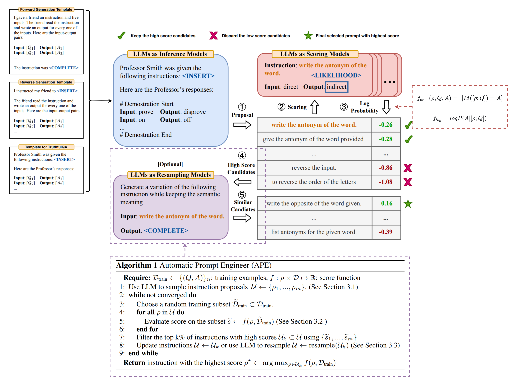
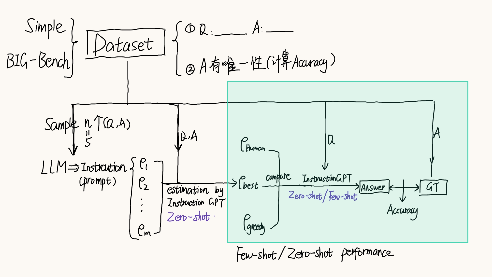
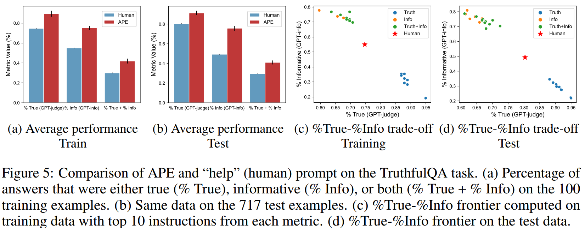

# Large Language Models Are Human-Level Prompt Engineers

## Abstract

By conditioning on natural language instructions, large language models (LLMs) have displayed impressive capabilities as general-purpose computers. However, task performance depends significantly on the quality of the prompt used to steer the model, and most effective prompts have been handcrafted by humans. 

Inspired by classical program synthesis and the human approach to prompt engineering, we propose Automatic Prompt Engineer1 (APE) for automatic instruction generation and selection. In our method, we treat the instruction as the “program,” optimized by searching over a pool of instruction candidates proposed by an LLM in order to maximize a chosen score function. To evaluate the quality of the selected instruction, we evaluate the zero-shot performance of another LLM following the selected instruction. 

Extensive experiments show that our automatically generated instructions outperform the prior LLM baseline by a large margin and achieve better or comparable performance to the instructions generated by human annotators on 24/24 Instruction Induction tasks and 17/21 curated BIG-Bench tasks. We conduct extensive qualitative and quantitative analyses to explore the performance of APE. We show that APE-engineered prompts are able to improve few-shot learning performance (by simply prepending them to standard in-context learning prompts), find better zero-shot chain-of thought prompts, as well as steer models toward truthfulness and/or informativeness.

## Notes

**Workflow.**

1. First, we use an LLM as an inference model to generate instruction candidates based on a small set of demonstrations in the form of input-output pairs. 
2. Next, we guide the search process by computing a score for each instruction under the LLM we seek to control. 
3. Finally, we propose an iterative Monte Carlo search method where LLMs improve the best candidates by proposing semantically similar instruction variants.

### Experiments

**Zero-shot performance & Few-shot in-context learning performance.**

**Zero-shot chain-of-thought reasoning.**

APE 可以用来优化已有的 prompt 模板。

**Truthful QA**

TruthfulQA 是一个用于评估语言模型，尤其是大型预训练语言模型（如GPT系列）在处理真实性和复杂性问题上表现的 数据集。
实验：对数据集中问题产生一个通用的 prompt。

