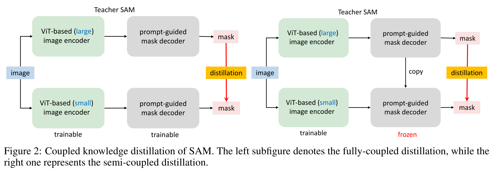
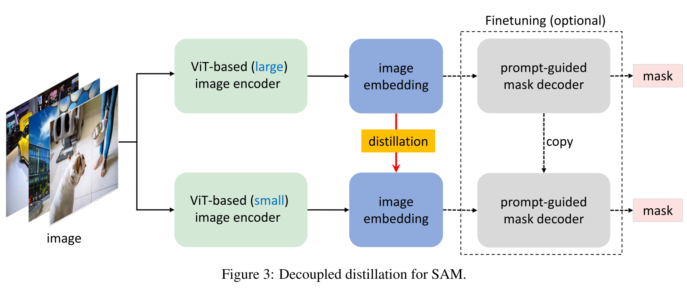

# Mobile SAM

## Abstract

Segment Anything Model (SAM) has attracted significant attention due to its impressive zero-shot transfer performance and high versatility for numerous vision applications (like image editing with fine-grained control). Many of such applications need to be run on resource-constraint edge devices, like mobile phones. 

In this work, we aim to make SAM mobile-friendly by replacing the heavyweight image encoder with a lightweight one. A naive way to train such a new SAM as in the original SAM paper leads to unsatisfactory performance, especially when limited training sources are available. We find that this is mainly caused by the coupled optimization of the image encoder and mask decoder, motivated by which we propose decoupled distillation. 

Concretely, we distill the knowledge from the heavy image encoder (ViT-H in the original SAM) to a lightweight image encoder, which can be automatically compatible with the mask decoder in the original SAM. The training can be completed on a single GPU within less than one day, and the resulting lightweight SAM is termed MobileSAM which is more than 60 times smaller yet performs on par with the original SAM. For inference speed, With a single GPU, MobileSAM runs around 10ms per image: 8ms on the image encoder and 4ms on the mask decoder. With superior performance, our MobileSAM is around 5 times faster than the concurrent FastSAM and 7 times smaller, making it more suitable for mobile applications. Moreover, we show that MobileSAM can run relatively smoothly on CPU.

## Notes

1. Coupled distillation -> Semi-coupled distillation -> Decoupled distillation

2. Loss of Decoupled distillation: **MSE Loss**
3. Setup: Tiny ViT

