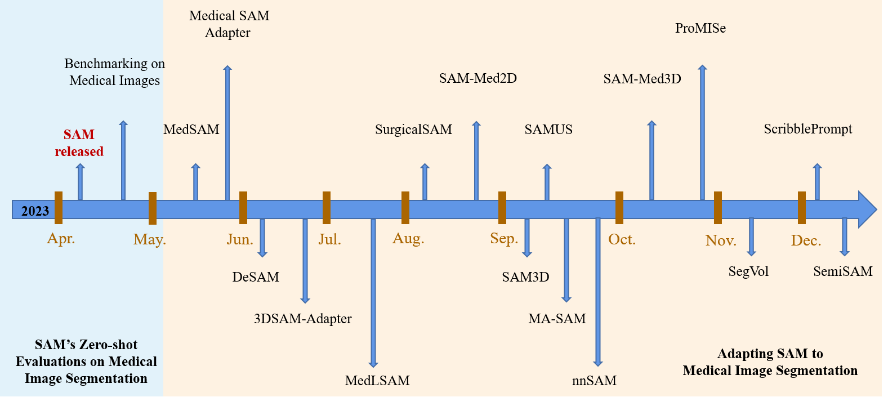

# Based on SAM

> *Segment Anything* Submitted on 5 Apr 2023

## 综述

### *A Comprehensive Survey on Segment Anything Model for Vision and Beyond*

> Submitted on 14 May 2023

#### SAM for Image Processing

- Software Scenes
  - Image Editing
  - Style Transfer
- Real-World Scenes
  - Detection
  - Counting
  - Moving Object Segmentation
- Complex Scenes

#### SAM for Medical Image

According to the imaging format of medical images, the usage of SAM in medical image segmentation can be categorized into six series: Computerized Tomography (CT) images, Magnetic Resonance Imaging (MRI) images, colonoscopy images, H&E stained histological sections images, multiple format images, and others.

### *Segment Anything Model for Medical Image Segmentation: Current Applications and Future Directions*

> Submitted on 7 Jan 2024

## 非综述

### *Segment Anything in Medical Images*

> Submitted on 24 Apr 2023

#### Abstract

Medical image segmentation is a critical component in clinical practice, facilitating accurate diagnosis, treatment planning, and disease monitoring. However, existing methods, often tailored to specific modalities or disease types, lack generalizability across the diverse spectrum of medical image segmentation tasks. 

Here we present MedSAM, a foundation model designed for bridging this gap by enabling universal medical image segmentation. The model is developed on a large-scale medical image dataset with **1,570,263** image-mask pairs, covering **10** imaging modalities and over **30** cancer types. We conduct a comprehensive evaluation on 86 internal validation tasks and 60 external validation tasks, demonstrating better accuracy and robustness than modality-wise specialist models. 

By delivering accurate and efficient segmentation across a wide spectrum of tasks, MedSAM holds significant potential to expedite the evolution of diagnostic tools and the personalization of treatment plans.

