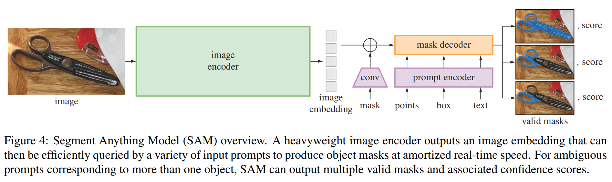

# Segment Anything

## Segment Anything Task

The promptable segmentation task is to return a valid segmentation mask given any prompt.

**Pre-training.** The promptable segmentation task suggests a natural pre-training algorithm that simulates a sequence of prompts (e.g., points, boxes, masks) for each training sample and compares the model’s mask predictions against the ground truth. Our aim is to always predict a valid mask for any prompt even when the prompt is **ambiguous**.

**Zero-shot transfer.** The pre-training task endows the model with the ability to respond appropriately to any prompt at inference time, and thus downstream tasks can be solved by engineering appropriate prompts.

**Discussion.** Prompting and composition are powerful tools that enable a single model to be used in **extensible** ways, potentially to accomplish tasks unknown at the time of model design. This approach is analogous to how other foundation models are used, e.g., how CLIP is the text-image alignment component of the DALL·E image generation system. 

## Segment Anything Model

SAM has three components: an image encoder, a flexible prompt encoder, and a fast mask decoder. 

### Image Encoder

We use an MAE pre-trained Vision Transformer (ViT). 

这个 Encoder ViT 针对于 $1024 \times 1024$ 的输入图片， 输出 $64 \times 64$ 的特征图。这个特征图的产生过程还用到了 256 channels 的卷积，所以输出是 $256 \times 64 \times 64$ 的特征图集合（256 个 64*64 的 向量）

### Prompt Encoder

- **Sparse prompts** are mapped to 256-dimensional vectorial:
  - **A point.** A positional encoding of the point’s location + one of two learned embeddings (that indicate if the point is either in the foreground or background).
  - **A box.** An embedding pair:
    - the positional encoding of its top-left corner summed + a learned embedding representing “top-left corner”.
    - the same structure but using a learned embedding indicating “bottom-right corner”.
  - **free-form text.** CLIP text encoder.
- **Dense prompts** (i.e., masks):
  - mask -> CNN -> + image embedding
  - If there is no mask prompt, a learned embedding representing “no mask” is added to each image embedding location.

### Lightweight Mask Decoder

1. self-attention on the tokens
2. cross-attention from tokens (as queries) to the image embedding
3. a point-wise MLP updates each token 
4. cross-attention from the image embedding (as queries) to tokens. 

During cross-attention, the image embedding is treated as a set of 64*64 256-dimensional vectors.

Each self/cross-attention and MLP has a residual connection, layer normalization, and a dropout of 0.1 at training. The next decoder layer takes the updated tokens and the updated image embedding from the previous layer. We use a two-layer decoder.

### Training

**Making the model ambiguity-aware.** By default we predict three masks, since we observe that three layers (whole, part, and subpart) are often enough to describe nested masks. During training, we compute the loss (described shortly) between the ground truth and each of the predicted masks, but only back-propagate from the lowest loss.

**Losses.** We supervise mask prediction with a linear combination of focal loss and dice loss in a 20:1 ratio of focal loss to dice loss.

**Training algorithm.** 

在训练过程中模拟了一个交互式分割设置。首先，等概率地随机选择一个前景点或边界框作为目标掩码。点是从真实掩码中均匀采样的。边界框取自真实掩码的边界框，并在每个坐标上添加随机噪声，标准差等于边框边长的10%，最多20像素。这种噪声配置是实例分割（产生紧贴目标对象的边框）和交互式分割（用户可能绘制一个松散的边框）等应用之间的合理妥协。

如果错误区域是假阴性或假阳性，每个新点分别为前景或背景。我们还将上一次迭代的掩码预测作为额外的提示提供给我们的模型。为了提供最大的信息给下一次迭代，我们提供未阈值化的掩码逻辑值而不是二值化掩码。当返回多个掩码时，传递给下一次迭代并用来采样下一个点的掩码是预测 IoU 最高的那个。

我们发现，在迭代采样 8 个点后，收益递减（我们测试了多达 16 个点）。此外，为了鼓励模型从提供的掩码中受益，我们还使用了两个额外的迭代，其中没有采样额外的点。这两个迭代中的一个随机插入在 8 个迭代采样点中，另一个总是在最后。这总共有 11 次迭代：一次采样的初始输入提示，8 次迭代采样点，以及两次没有向模型提供新的外部信息的迭代，以便它可以学习精细化自己的掩码预测。我们注意到，使用相对较多的迭代次数是可能的，因为我们轻量级的掩码解码器所需的计算量不到图像编码器的 1%，因此，每次迭代只增加了一小部分开销。这与之前的交互方法不同，后者每次优化器更新只进行一次或几次交互步骤。

## Segment Anything Data Engine

Assisted-manual Stage -> Semi-automatic Stage -> Fully Automatic Stage

**Assisted-manual Stage.** (1) SAM was trained using common public segmentation datasets. (2) After sufficient data annotation (by human), SAM was retrained using only newly annotated masks. (3) As more masks were collected, the image encoder was scaled from ViT-B to ViT-H and other architectural details evolved.

**Semi-automatic Stage.** aiming to increase the *diversity*. We first automatically detected confident masks. Then we presented annotators with images prefilled with these masks and asked them to annotate any additional unannotated objects.

**Fully Automatic Stage.** In the final stage, annotation was fully *automatic*. (1) At the start of this stage, we had collected enough masks to greatly improve the model, including the diverse masks from the previous stage. (2) we prompted the model with a 32×32 regular grid of points and for each point predicted a set of masks that may correspond to valid objects. (3) After selecting the confident and stable masks, we applied non-maximal suppression (NMS) to filter duplicates. To further improve the quality of smaller masks, we also processed multiple overlapping zoomed-in image crops.

## Limitation

While SAM performs well in general, it is not perfect. 
1. It can miss fine structures, hallucinates small disconnected components at times, and does not produce boundaries as crisply as more computationally intensive methods that “zoom-in”. In general, we expect dedicated interactive segmentation methods to outperform SAM when many points are provided. Unlike these methods, **SAM is designed for generality and breadth of use rather than high IoU interactive segmentation**. 
2. SAM can process prompts in real-time, but nevertheless SAM’s overall performance is not real-time when using a heavy image encoder. 
3. Our foray into the text-to-mask task is exploratory and not entirely robust, although we believe it can be improved with more effort. 
4. While SAM can perform many tasks, it is unclear how to design simple prompts that implement semantic and panoptic segmentation. 
5. There are domain-specific tools that we expect to outperform SAM in their respective domains.
