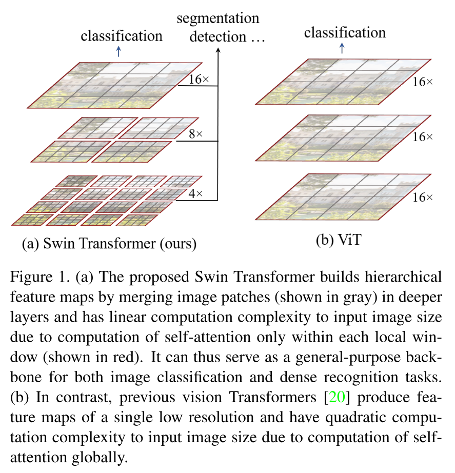
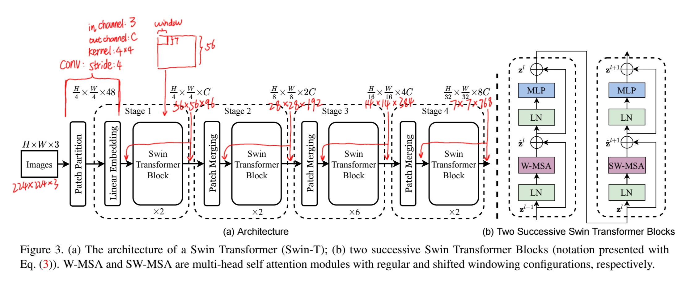
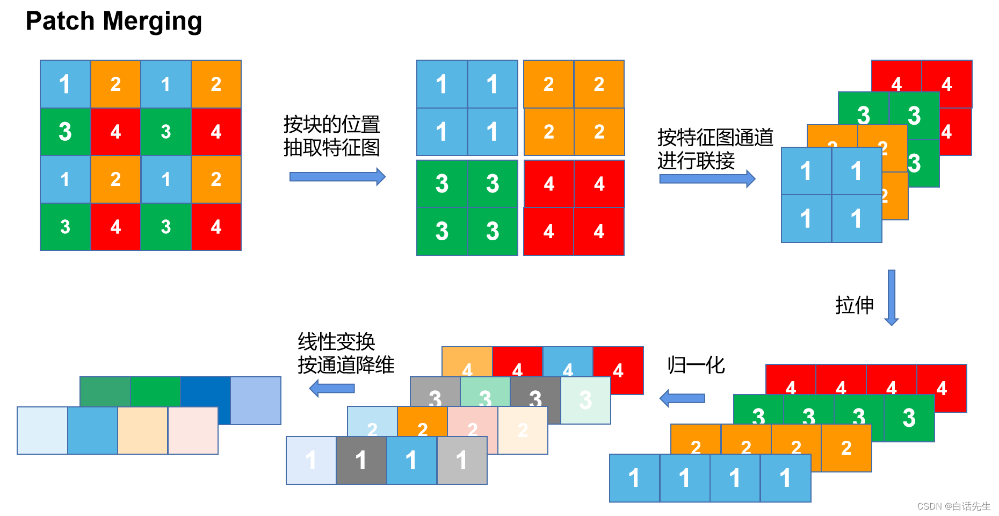
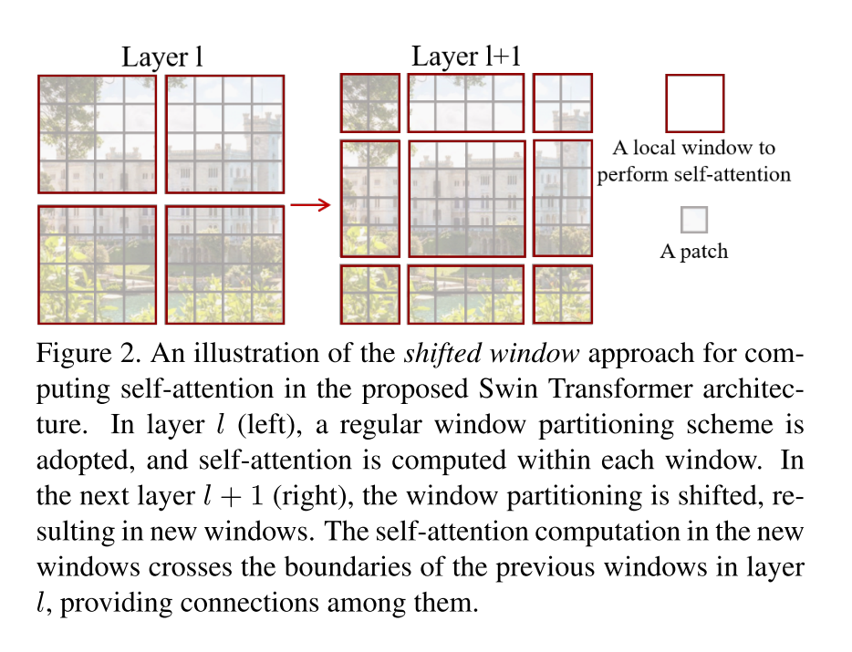
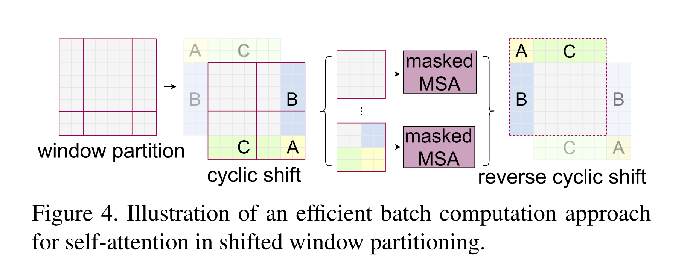
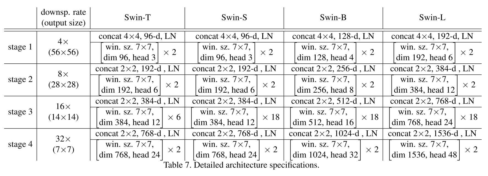

# Swin-Transformer

## Abstract

This paper presents a new vision Transformer, called Swin Transformer, that capably serves as a general-purpose backbone for computer vision. Challenges in adapting Transformer from language to vision arise from differences between the two domains, such as large variations in the scale of visual entities and the high resolution of pixels in images compared to words in text.

To address these differences, we propose a hierarchical Transformer whose representation is computed with Shifted windows. The shifted windowing scheme brings greater efficiency by limiting self-attention computation to non-overlapping local windows while also allowing for cross-window connection. This hierarchical architecture has the flexibility to model at various scales and has linear computational complexity with respect to image size. 

These qualities of Swin Transformer make it compatible with a broad range of vision tasks, including image classification (87.3 top-1 accuracy on ImageNet-1K) and dense prediction tasks such as object detection (58.7 box AP and 51.1 mask AP on COCO test-dev) and semantic segmentation (53.5 mIoU on ADE20K val). Its performance surpasses the previous state-of-the-art by a large margin of+2.7 box AP and +2.6 mask AP on COCO, and +3.2 mIoU on ADE20K, demonstrating the potential of Transformer-based models as vision backbones. The hierarchical design and the shifted window approach also prove beneficial for all-MLP architectures.

## Notes

### Backbone

### Patch Merging

> https://blog.csdn.net/liuweizj12/article/details/125094643

### Shifted Windows Multi-Head Self-Attention

### Relative Position Bias

$$
\text{Attention}(Q,K,V) = \text{SoftMax}(QK^T / \sqrt{d} + B)V
$$

https://blog.csdn.net/qq_37541097/article/details/121119988

### Config

T(Tiny), S(Small), B(Base), L(Large):

