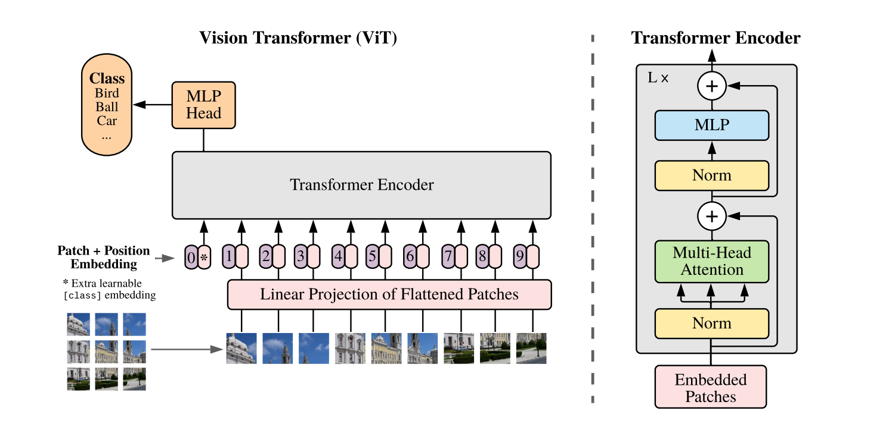
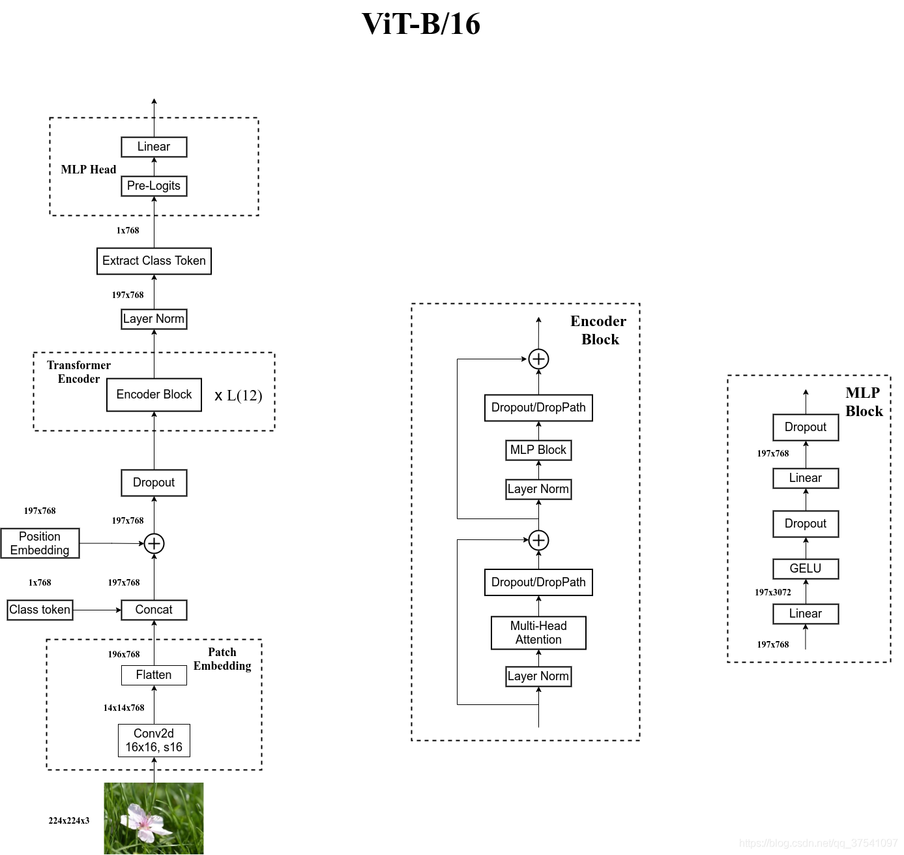

# ViT

$$
\begin{align}
{z}_0 &= [ {x}_\text{class}; \, {x}^1_p {E}; \, {x}^2_p {E}; \cdots; \, {x}^{N}_p {E} ] + {E}_{pos}, && {E} \in \mathbb{R}^{(P^2 \cdot C) \times D},\, {E}_{pos}  \in \mathbb{R}^{(N + 1) \times D} \tag{1} \\
{z^\prime}_\ell &= \text{MSA}(\text{LN}({z}_{\ell-1})) + {z}_{\ell-1}, && \ell=1\ldots L \tag{2} \\
{z}_\ell &= \text{MLP}(\text{LN}({z^\prime}_{\ell})) + {z^\prime}_{\ell}, && \ell=1\ldots L  \tag{3} \\
{y} &= \text{LN}({z}_L^0) \tag{4}
\end{align}
$$

在论文的Table1中有给出三个模型（Base/ Large/ Huge）的参数，在源码中除了有Patch Size为16x16的外还有32x32的。其中的Layers就是Transformer Encoder中重复堆叠Encoder Block的次数，Hidden Size就是对应通过Embedding层后每个token的dim（向量的长度），MLP size是Transformer Encoder中MLP Block第一个全连接的节点个数（是Hidden Size的四倍），Heads代表Transformer中Multi-Head Attention的heads数。

|Model|Patch Size|Layers|Hidden Size D|MLP size|Heads|Params|
|:-:|:-:|:-:|:-:|:-:|:-:|:-:|
|ViT-Base|16x16|12|768|3072|12|86M|
|ViT-Large|16x16|24|1024|4096|16|307M|
|ViT-Huge|14x14|32|1280|5120|16|632M|

