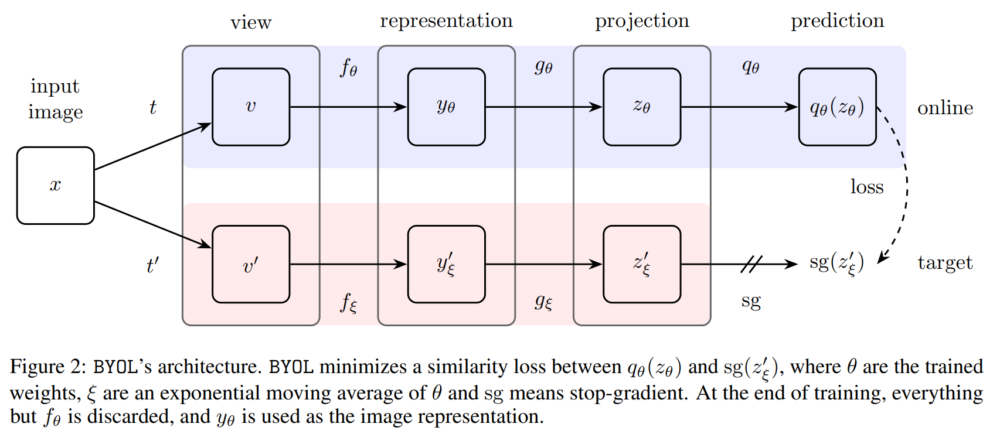

# Contrastive Learning

**对比学习：**
依靠 pretext task (eg.instance discrimination, predictions) 训练一个 encoder (eg. ResNet50)。要求这个 encoder 可以提取图像的特征，然后其可以应用到下游任务上 (classification / detection)。

**摘要：关于对比学习中的几个问题**
- **如何选正负样本？**
  - 一个 batch 里选（end-to-end） --> 问题是样本量不够大
    - batch 大一些：Sim-CLRv1
  - 样本量大：memory bank --> 问题是一致性不强
    - MoCov1：样本量大，一致性强
      - queue --> dictionary
      - momentum update parameters
  - 什么样的样本是正样本？ --> augmentation, predictive coding, multi-view...
- **代理任务是什么？**
  - Instance Discrimination
  - Contrastive Predictive Coding
- **不用负样本？**
  - 聚类中心：SWaV
  - “自己”预测“自己”：BYOL，SimSiam
- **encoder 的选择**
  - CNN
  - Vision Transformer
    - DINO
    - MoCov3

## Phase 1

### Inva Spread - 6 April 2019


### Inst Disc (Memory Bank) - 5 May 2018


### CPC (Contrastive Predictive Coding) - 10 July 2018


### CMC (Contrastive Multiview Coding) - 13 Jun 2019

## Phase 2

### MoCov1 (Momentum Contrast) - 13 November 2019

- queue --> dictionary
- momentum update parameters


```python
# f_q, f_k: encoder networks for query and key
# queue: dictionary as a queue of K keys (CxK)
# m: momentum
# t: temperature --> "InfoNCE" Loss Function --> a (K + 1) classification problem

f_k.params = f_q.params # initialize

for x in loader: # load a minibatch x with N samples
    x_q = aug(x) # a randomly augmented version
    x_k = aug(x) # another randomly augmented version

    q = f_q.forward(x_q) # queries: NxC
    k = f_k.forward(x_k) # keys: NxC
    k = k.detach() # no gradient to keys
    # 返回一个新的tensor，从当前计算图中分离下来的，但是**仍指向原变量的存放位置**,不同之处只是requires_grad为false，得到的这个tensor永远不需要计算其梯度，不具有grad。

    # positive logits: Nx1
    l_pos = bmm(q.view(N,1,C), k.view(N,C,1))
    # negative logits: NxK
    l_neg = bmm(q.view(N,C), queue.view(C,K))

    # logits: Nx(1+K)
    logits = cat([l_pos, l_neg], dim=1)

    # contrastive loss
    labels = zeros(N) # positives are the 0-th
    loss = CrossEntropyLoss(logits/t, labels)

    # SGD update: query network
    loss.backward()
    update(f_q.params)

    # momentum update: key network
    f_k.params = m*f_k.params+(1-m)*f_q.params

    # update dictionary
    enqueue(queue, k) # enqueue the current minibatch
    dequeue(queue) # dequeue the earliest minibatch
```

### SimCLRv1 - 13 February 2020


- Composition of multiple data augmentation operations
- Introducing a learnable nonlinear transformation between the representation and the contrastive loss
- Contrastive learning benefits from larger batch sizes and longer training compared to its supervised counterpart.

### MoCov2 - 9 March 2020

MoCov1 + improvements from SimCLRv1 (mlp + lr schedule + aug)

### SimCLRv2 - 17 June 2020

**自监督 + 半监督**


v1 --> v2:
- ResNet152
- projection head --> 2 layers
- momentum encoder

## Phase 3

### SWaV (Contrasting Cluster Assignments) - 17 Jun 2020


- 负样本 -> 聚类中心
- multi-crop

### BYOL - 10 Sep 2020



Batch norm --> 信息泄漏 --> 还是对比负样本了？

### SimSiam - 20 November 2020


## Phase 4 - based on ViT (Vision Transformer)

Standard Transformer --> Vision
Image --> N * 16 * 16 words --> Transformer encoder


### MoCov3 - 5 April 2021

**冻住 patch projection layer**

```python
# f_q: encoder: backbone + proj mlp + pred mlp
# f_k: momentum encoder: backbone + proj mlp
# m: momentum coefficient
# tau: temperature

for x in loader: # load a minibatch x with N samples
  x1, x2 = aug(x), aug(x) # augmentation
  q1, q2 = f_q(x1), f_q(x2) # queries: [N, C] each
  k1, k2 = f_k(x1), f_k(x2) # keys: [N, C] each

  loss = ctr(q1, k2) + ctr(q2, k1) # symmetrized
  loss.backward()

  update(f_q) # optimizer update: f_q

  f_k = m*f_k + (1-m)*f_q # momentum update: f_k

# contrastive loss
def ctr(q, k):
  logits = mm(q, k.t()) # [N, N] pairs
  labels = range(N) # positives are in diagonal
  loss = CrossEntropyLoss(logits/tau, labels)
  return 2 * tau * loss
```

### DINO - 29 April 2021

**centering**


